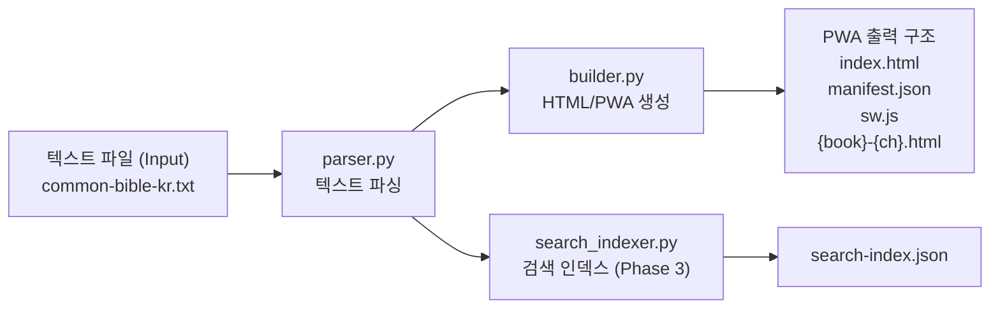
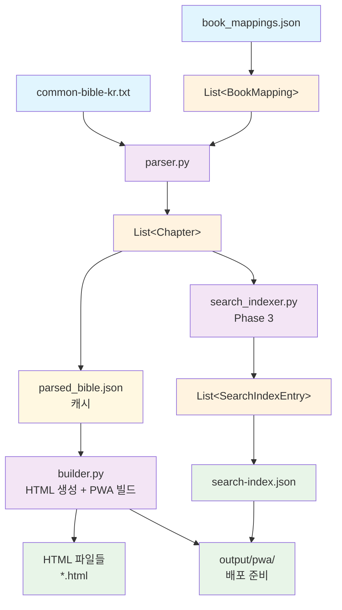
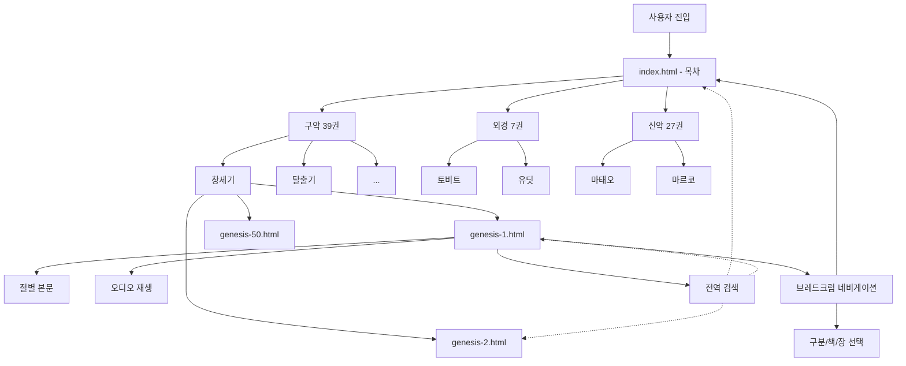

# 공동번역성서 프로젝트 설계서

## 📋 개요

공동번역성서 텍스트 파일(`common-bible-kr.txt`)을 장 단위로 파싱하여 접근성을 지원하는 HTML로 변환하고, 웹 서버나 사용자 단말에서 실행할 수 있는 PWA(Progressive Web App)를 구축하는 시스템입니다.

---

## 🎯 프로젝트 목표

1. **텍스트 파싱**: 원본 텍스트를 장 단위로 분리
2. **HTML 변환**: 접근성을 고려한 HTML 생성 (오디오 파일 포함)
3. **PWA 구축**: 정적 파일 기반 Progressive Web App 생성
4. **목차 생성**: 전체 성경 목차 페이지 자동 생성
5. **오프라인 지원**: 서비스 워커를 통한 오프라인 접근 지원

---

## 📅 개발 계획 (Phase별 로드맵)

### **Phase 1: 핵심 리더 (MVP) 및 파서**

#### 목표

- 성경 텍스트 파싱 및 접근성 HTML 생성
- 오디오 통합 및 기본 반응형 CSS 적용

#### 주요 기능

- **텍스트 파싱**: `parser.py`로 `common-bible-kr.txt`를 장/절/단락 단위로 파싱하여 JSON 분할
- **HTML 변환**: 절 번호 + 본문을 접근성을 고려하여 HTML로 출력 (`builder.py`)
- **시맨틱 마크업**: `aria-hidden`, 고유 `id` 앵커 등 접근성 구성
- **오디오 통합**: 오디오 파일 존재 여부 확인 및 조건부 표시 (부재 시 대체 메시지)
- **기본 CSS**: 반응형 스타일링 적용

#### 성공 기준

- [ ] 성경 장/절/단락별 파싱 로직 구현 (`parser.py`)
- [ ] 절 번호 + 본문을 접근성을 고려하여 HTML로 출력하는 템플릿 정의
- [ ] 시맨틱 마크업 구성 (`aria-hidden`, 고유 `id` 앵커 등)
- [ ] 오디오 파일 존재 여부 확인 및 조건부 표시 로직 구현 (부재 시 대체 메시지 포함)
- [ ] 모든 책/장별 유효한 HTML 파일 생성 로직 구현 (`builder.py`)
- [ ] 기본적인 반응형 CSS 스타일링 적용

### **Phase 2: PWA, 네비게이션 및 접근성**

#### 목표

- PWA 기능 구현 (매니페스트, 서비스 워커, 오프라인)
- 전체 네비게이션 시스템 구축
- WCAG 2.1 AA 접근성 준수

#### 주요 기능

- **네비게이션**: 브레드크럼, 이전/다음 장 버튼 구현
- **목차 페이지**: `index.html` 자동 생성
- **PWA 매니페스트**: `manifest.json` 생성
- **서비스 워커**: `sw.js` 구현 및 오프라인 캐싱
- **접근성**: 스크린 리더 테스트 및 WCAG 2.1 AA 준수

#### 성공 기준

- [ ] 브레드크럼, 이전/다음 장 등 전체 네비게이션 구현
- [ ] 목차 페이지(`index.html`) 자동 생성 로직
- [ ] PWA 매니페스트(`manifest.json`) 및 서비스 워커(`sw.js`) 구현
- [ ] 오프라인 캐싱 전략 구현
- [ ] 스크린 리더 테스트 및 WCAG 2.1 AA 기준 준수 확인

### **Phase 3: 전역 검색 및 고도화**

#### 목표

- 전체 텍스트 검색 시스템 구축
- 모바일 최적화 및 배포

#### 주요 기능

- **검색 인덱스**: `search_indexer.py`로 전체 텍스트 검색용 단일 JSON 인덱스 생성
- **Web Worker 검색**: UI 블록킹 없는 검색 로직 및 UI 구현 (지연 로딩, 페이지네이션)
- **하이라이트**: 검색 결과 본문 내 하이라이트
- **모바일 최적화**: 반응형 디자인 및 터치 최적화 (바텀시트 등)
- **배포**: 정적 파일 배포 설정 및 보안(HTTPS, XSS 방지 등) 검토

#### 성공 기준

- [ ] 전체 텍스트 검색을 위한 단일 인덱스 생성 (`search_indexer.py`)
- [ ] Web Worker 기반 전역 검색 로직 및 UI 구현 (지연 로딩, 페이지네이션)
- [ ] 검색 결과 본문 내 하이라이트 기능 추가
- [ ] 반응형 디자인 및 모바일 터치 최적화 (바텀시트 등)
- [ ] 정적 파일 배포 설정 및 보안(HTTPS, XSS 방지 등) 검토
- [ ] 성능 최적화 및 오류 로깅 체계 구축

---

## 🏗️ 시스템 아키텍처



---

## 📂 프로젝트 구조

```
common-bible/
├── src/
│   ├── __init__.py
│   ├── parser.py           # 텍스트 파일 파싱 및 JSON 저장/로드, 캐시 지원, CLI 포함
│   ├── builder.py          # 정적 사이트 생성 (HTML/PWA: 접근성/오디오/목차/매니페스트/SW)
│   └── search_indexer.py   # 검색 인덱스 생성 (전역 검색용 단일 JSON 인덱스, Phase 3)
├── templates/
│   ├── chapter.html        # 장 페이지 HTML 템플릿
│   ├── index.html          # 목차 페이지 템플릿
│   ├── manifest.json       # PWA 매니페스트 템플릿
│   └── sw.js               # 서비스 워커 템플릿 (기본 오프라인 캐싱)
├── static/
│   ├── verse-style.css     # 스타일시트 (기본 글꼴 Pretendard)
│   ├── verse-navigator.js  # 검색/하이라이트/오디오/네비게이션 스크립트
│   ├── search-worker.js    # 전역 검색 Web Worker (Phase 3)
│   └── icons/              # PWA 아이콘 파일들
│       ├── icon-192x192.png
│       ├── icon-256x256.png
│       ├── icon-512x512.png
│       ├── apple-touch-icon-180.png
│       └── favicon.ico
├── data/
│   ├── common-bible-kr.txt # 원본 텍스트 (공동번역성서)
│   ├── audio/              # 오디오 파일 디렉토리 (*.mp3)
│   └── book_mappings.json  # 성경 책 메타데이터 (약칭, 영문명, 분류 등)
├── output/                 # 파서/생성기 출력 디렉터리
│   ├── parsed_bible.json   # 파싱된 중간 데이터 (JSON 캐시)
│   └── pwa/                # PWA 빌드 출력 (배포 준비 완료)
│       ├── index.html      # 목차 페이지
│       ├── manifest.json   # PWA 매니페스트
│       ├── sw.js           # 서비스 워커
│       ├── static/         # CSS, JS, 아이콘
│       └── *.html          # 각 장별 HTML 파일
├── logs/                   # 로그 파일 (필요 시)
├── .env.example            # 환경변수 예제
├── requirements.txt        # Python 패키지 목록
├── setup.py                # 패키지 설정
└── README.md               # 프로젝트 설명서
```

---

## 📊 데이터 모델

### 핵심 데이터 구조

#### Chapter 클래스 (파싱 결과)

```python
from dataclasses import dataclass
from typing import List

@dataclass
class Chapter:
    """성경 장 데이터 모델 (언어 비종속 코어만 유지)"""
    book_id: str            # 책 ID (언어 중립, 예: "gen")
    chapter_number: int     # 장 번호 (예: 1)
    verses: List[Verse]     # 절 목록
    # 선택적: 원문 약칭 보존이 필요할 때만 사용
    source_abbr: str | None = None

    # 파생 속성 (계산됨)
    @property
    def chapter_id(self) -> str:
        """장 고유 ID (언어 중립 id 기반)"""
        return f"{self.book_id}-{self.chapter_number}"

    @property
    def english_slug(self) -> str:
        """영어 기반 URL 슬러그 (파일명 생성용, 예: genesis)

        주입 시점: 빌드 또는 런타임에서 book_id → names.en로 해석해 생성
        """
        return resolve_english_slug(self.book_id)
```

`book_mappings.json` 파일과의 정합:

- 검색/앵커 ID는 언어 중립 `id`(예: `gen`)를 사용하고, 파일명은 `english_slug`(예: `genesis`)를 사용합니다.
- `id`는 `book_mappings.json`의 `id` 필드에서 오며, UI 표시는 `names.{ko,en}`를 사용합니다.

#### Verse 클래스 (절 데이터)

```python
@dataclass
class Verse:
    """성경 절 데이터 모델"""
    number: int             # 절 번호 (예: 1)
    text: str              # 절 내용 (¶ 제거됨)
    has_paragraph: bool    # 단락 시작 여부 (¶ 존재했는지)

    # 파생 속성
    @property
    def verse_id(self) -> str:
        """절 고유 ID (부모 Chapter와 조합)"""
        # 사용법: f"{chapter.english_slug}-{chapter.chapter_number}-{verse.number}"
        return f"{self.number}"

    @property
    def clean_text(self) -> str:
        """정제된 텍스트 (HTML 이스케이프 적용)"""
        import html
        return html.escape(self.text.strip())
```

#### BookMapping 클래스 (메타데이터)

```python
@dataclass
class BookMapping:
    """책 메타데이터 모델 (book_mappings.json Option A 스키마)"""
    id: str                        # 언어 중립 ID (영문 약칭 기반, 예: "gen")
    book_order: int                # 정렬용 순서 (0부터 시작, 외경 포함 일관)
    names: dict                    # 다국어 이름 {"ko": "창세기", "en": "Genesis"}
    division: dict                 # 다국어 구분 {"ko": "구약", "en": "Old Testament"}
    aliases: dict                  # 다국어 별칭 {"ko": ["창세", ...], "en": ["gen", ...]}

    @property
    def english_abbr(self) -> str:
        """영어 약칭 (ID 생성 및 파일명 슬러그에 사용)"""
        return get_english_abbr(self.names.get("en", ""))
```

### 검색 인덱스 구조

#### SearchIndexEntry 클래스

```python
@dataclass
class SearchIndexEntry:
    """검색 인덱스 항목 (JSON 압축을 위해 단축키 사용)"""
    i: str    # id: 절 ID (book_id 기반, 예: "gen-1-1")
    t: str    # text: 절 내용
    h: str    # href: HTML 파일 경로 (예: "genesis-1.html#gen-1-1")
    b: str    # book: book_id (언어 중립, 예: "gen")
    c: int    # chapter: 장 번호
    v: int    # verse: 절 번호
    bo: int   # book_order: 책 순서 (정렬용)

    def to_dict(self) -> dict:
        """JSON 직렬화용 딕셔너리 변환"""
        return {
            "i": self.i,
            "t": self.t,
            "h": self.h,
            "b": self.b,
            "c": self.c,
            "v": self.v,
            "bo": self.bo
        }
```

### PWA 빌드 설정

#### PWAConfig 클래스

```python
@dataclass
class PWAConfig:
    """PWA 빌드 설정"""
    app_name: str = "공동번역성서"
    short_name: str = "공동번역성서"
    start_url: str = "index.html"
    display: str = "standalone"
    theme_color: str = "#4CAF50"
    background_color: str = "#FFFFFF"
    icons: List[dict] = None

    # 보안 설정
    enable_sri: bool = True
    csp_policy: str = "strict"  # "strict", "moderate", "development"

    def __post_init__(self):
        if self.icons is None:
            self.icons = [
                {"src": "static/icons/icon-192x192.png", "sizes": "192x192", "type": "image/png", "purpose": "any"},
                {"src": "static/icons/icon-256x256.png", "sizes": "256x256", "type": "image/png", "purpose": "any"},
                {"src": "static/icons/icon-512x512.png", "sizes": "512x512", "type": "image/png", "purpose": "any maskable"}
            ]
```

### 유틸리티 함수

#### 영어 약칭 생성 (ID 규칙 참고)

```python
def get_english_abbr(english_name: str) -> str:
    """영어 책 이름에서 약칭 추출 (일관성 있는 ID 생성용)"""
    name = english_name.lower()
    if ' ' in name:
        parts = name.split()
        if parts[0].isdigit():
            # "1 Kings" → "1-kin"
            return f"{parts[0]}-{parts[1][:3]}"
        else:
            # "Song of Songs" → "song"
            return parts[0][:4]
    else:
        # "Genesis" → "gene" (4글자로 통일)
        return name[:4]
```

### 데이터 플로우 요약



---

## 🔧 핵심 모듈 설계

### 1. 파서 & 변환기

#### 1.1 텍스트 파서 (parser.py)

요구사항([prd.md](./prd.md))에 맞춘 파서 설계입니다. 장 식별, 첫 절 포함 라인 처리, 단락(`¶`) 인식, JSON 캐시, CLI를 포함합니다.

##### 1.1.1 입력 포맷 규칙 요약

- 장 시작 패턴: `^([^\s]+)\s+([0-9]+)[.:：,]([0-9]+)\s*(.*)?$`
  - 첫 토큰은 별칭/이름/ID를 `book_mappings.json`으로 정규화하여 `book_id`로 해석
  - 예: `창세 1:1 …`, `Gen 1:1 …` (첫 줄에 1절 본문 포함 가능)
- 두 번째 줄부터: `^([0-9]+)\s+(.*)$`
- 단락 구분: `¶`가 새 단락 시작을 의미

##### 1.1.2 입력 파일 예시 (`data/common-bible-kr.txt`)

**구약 (창세기) 예시:**

```
창세 1:1 ¶ 한처음에 하느님께서 하늘과 땅을 지어내셨다.
2 땅은 아직 모양을 갖추지 않고 아무것도 생기지 않았는데, 어둠이 깊은 물 위에 뒤덮여 있었고 그 물 위에 하느님의 기운이 휘돌고 있었다.
3 ¶ 하느님께서 "빛이 생겨라!" 하시자 빛이 생겨났다.
4 그 빛이 하느님 보시기에 좋았다. 하느님께서는 빛과 어둠을 나누시고
5 빛을 낮이라, 어둠을 밤이라 부르셨다. 이렇게 첫날이 밤, 낮 하루가 지났다.

창세 2:1 ¶ 이리하여 하늘과 땅과 그 가운데 있는 모든 것이 다 이루어졌다.
2 하느님께서는 엿샛날까지 하시던 일을 다 마치시고, 이렛날에는 모든 일에서 손을 떼고 쉬셨다.
```

**외경 (토비트) 예시:**

```
토비 1:1 ¶ 이 책은 토비트에 관한 이야기를 적은 것이다. 토비트는 납달리 지파의 아시엘 집안에 속한 사람으로서...
토비 2:1 ¶ 에살하똔 왕 때에 나는 집으로 돌아와 내 아내 안나와 아들 토비아를 되찾게 되었다.
```

**신약 (마태복음) 예시:**

```
마태 1:1 ¶ 아브라함의 후손이요, 다윗의 자손인 예수 그리스도의 족보는 다음과 같다.
2 아브라함은 이사악을 낳고, 이사악은 야곱을 낳고, 야곱은 유다와 그의 형제들을 낳았다.
3 유다는 다말에게서 베레스와 세라를 낳고, 베레스는 헤스론을 낳고, 헤스론은 람을 낳았다.

마태 2:1 ¶ 예수께서 헤로데 왕 때에 유다 베들레헴에서 나셨는데 그 때에 동방에서 박사들이 예루살렘에 와서
2 "유다인의 왕으로 나신 분이 어디 계십니까? 우리는 동방에서 그분의 별을 보고 그분께 경배하러 왔습니다." 하고 물었다.
```

**파싱 패턴 분석:**

1. **장 시작 라인**: `{책명} {장}:{첫절번호} [¶] {첫절내용}`

   - `창세 1:1 ¶ 한처음에...` → 책명="창세", 장=1, 절=1, 첫절내용="¶ 한처음에..."
   - `토비 2:1 ¶ 에살하똔 왕...` → 책명="토비", 장=2, 절=1, 첫절내용="¶ 에살하똔 왕..."

2. **일반 절 라인**: `{절번호} [¶] {절내용}`

   - `2 땅은 아직 모양을...` → 절=2, 내용="땅은 아직 모양을..."
   - `3 ¶ 하느님께서...` → 절=3, 내용="¶ 하느님께서..." (단락 시작)

3. **단락 표시**: `¶` 기호가 절 내용 앞에 나타남
   - 새로운 단락의 시작을 의미
   - HTML 생성 시 `<p>` 태그 구분에 활용

##### 1.1.3 데이터 모델

**추상 데이터 구조:**

- `Verse { number: int, text: str, has_paragraph: bool }`
- `Chapter { book_id: str, chapter_number: int, verses: List[Verse] }`
- **라벨 주입(빌드/런타임)**: `resolve_book_label(book_id, lang) → { name, abbr, division }`

**`parsed_bible.json` 파일 구조 예시 (언어 중립 코어 + 언어별 오버레이):**

Phase 1: 코어(본문만 저장, 언어 중립 ID 기반) — 라벨은 런타임 해석

```json
{
  "book_id": "gen",
  "chapter_number": 1,
  "verses": [
    {
      "number": 1,
      "text": "한처음에 하느님께서 하늘과 땅을 지어내셨다.",
      "has_paragraph": true
    }
  ]
}
```

Phase 2: 다국어/라벨 확장(필요 시 메타 포함, 혹은 별도 라벨 파일)

앞서 본 `common-bible-kr.txt` 입력이 `parser.py`로 처리되면 `output/parsed_bible.json`에 다음과 같은 구조로 저장됩니다:

```json
{
  "book_id": "gen", // book_mappings.json의 id
  "book_name": "창세기", // 렌더링 시점 언어에 따라 names.{lang}
  "book_abbr": "창세", // aliases.{lang}[0] 우선
  "chapter_number": 1,
  "verses": [
    {
      "number": 1,
      "text": "한처음에 하느님께서 하늘과 땅을 지어내셨다.",
      "has_paragraph": true
    },
    {
      "number": 2,
      "text": "땅은 아직 모양을 갖추지 않고 아무것도 생기지 않았는데, 어둠이 깊은 물 위에 뒤덮여 있었고 그 물 위에 하느님의 기운이 휘돌고 있었다.",
      "has_paragraph": false
    },
    {
      "number": 3,
      "text": "하느님께서 \"빛이 생겨라!\" 하시자 빛이 생겨났다.",
      "has_paragraph": true
    },
    {
      "number": 4,
      "text": "그 빛이 하느님 보시기에 좋았다. 하느님께서는 빛과 어둠을 나누시고",
      "has_paragraph": false
    },
    {
      "number": 5,
      "text": "빛을 낮이라, 어둠을 밤이라 부르셨다. 이렇게 첫날이 밤, 낮 하루가 지났다.",
      "has_paragraph": false
    }
  ]
}
```

**다국어 메타데이터 확장 (Phase 1):**

`parser.py`가 `parsed_bible.json` 생성 시, 코어만 저장하며 라벨은 빌드/런타임에 주입합니다:

```json
{
  "book_id": "gen",                 // book_mappings.json id
  "chapter_number": 1,
  "verses": [...]
}
```

**데이터 예시:**

```json
{
  "book_id": "tob",
  "chapter_number": 1,
  "verses": [
    {
      "number": 1,
      "text": "이 책은 토비트에 관한 이야기를 적은 것이다. 토비트는 납달리 지파의 아시엘 집안에 속한 사람으로서 그의 아버지는 토비엘, 할아버지는 하나니엘, 증조부는 아두엘, 고조부는 가바엘이었다. 가바엘의 아버지는 라파엘이었고 할아버지는 라구엘이었다.",
      "has_paragraph": true
    }
  ]
}
```

**특수 케이스 처리:**

1. **¶ 기호 처리**: `text` 필드에서는 ¶ 기호가 제거되고 `has_paragraph` 필드로 분리(HTML 생성 시 표시됨)

   - 원본: `"¶ 한처음에 하느님께서..."`
   - `parsed_bible.json` 파싱 후: `text: "한처음에 하느님께서..."`, `has_paragraph: true`
   - HTML 생성 후: `<span class="paragraph-marker">¶</span>한처음에 하느님께서...`

2. **인용부호 이스케이핑**: JSON 저장을 위해 따옴표 이스케이프 처리

   - 원본: `하느님께서 "빛이 생겨라!" 하시자`
   - 파싱 후: `하느님께서 \"빛이 생겨라!\" 하시자`

3. **긴 절 처리**: 절 내용이 길어도 단일 문자열로 저장
   - 줄바꿈 없이 연속된 텍스트로 보존

**키 명명 규칙 정리:**

- **`book_mappings.json`**: `{ id, book_order, names.{ko,en}, division.{ko,en}, aliases.{ko,en} }`
- **`parsed_bible.json`의 Chapter 객체**: `{ book_name, book_abbr, english_name, division_ko, division_en, ... }`
- **검색 인덱스**: `{ b: id, i: "{id}-{c}-{v}" }` 형태로 언어 중립 유지

**데이터 플로우 요약:**

1. **입력**: `data/common-bible-kr.txt` + `data/book_mappings.json`
2. **파싱**: `parser.py` 실행 → 텍스트 구조화 + 메타데이터 확장
3. **출력**: `output/parsed_bible.json` (중간 캐시 파일)
4. **이후 단계**: HTML 생성기 → PWA 빌드 → 최종 배포

##### 1.1.4 파싱 알고리즘

1. 파일을 줄 단위로 순회
2. 장 시작 정규식 매칭 시 현재 장을 종료/저장하고 새 장을 시작
   - 같은 줄의 첫 절 텍스트가 존재하면 `number=1`로 생성하고 `has_paragraph`는 텍스트 내 `¶` 여부로 설정
3. 일반 절 라인은 숫자+공백 패턴으로 파싱
4. 파일 종료 시 마지막 장을 저장

**에지 케이스**

- 빈 줄은 무시 (장 구분은 오직 패턴으로 수행)
- 잘못된 라인은 스킵 (로그로 보고)
- 책 약칭 매핑이 없으면 원문 약칭 그대로 사용

##### 1.1.5 정규식

텍스트 본문에서 장과 절 패턴을 식별해 구조화하여 JSON으로 저장할 때 사용합니다.

**장 시작 패턴**: `r"^([가-힣0-9]+)\s+([0-9]+):([0-9]+)\s*(.*)?$"`

구성 요소 설명:

- `^` : 라인 시작
- `([가-힣0-9]+)` : **그룹 1** - 책 이름 (한글 + 숫자, 1자 이상)
  - 예: `창세`, `2마카`, `1열왕`
- `\s+` : 공백 문자 1개 이상
- `([0-9]+)` : **그룹 2** - 장 번호 (숫자, 1자 이상)
- `:` : 콜론 문자 (리터럴)
- `([0-9]+)` : **그룹 3** - 절 번호 (숫자, 1자 이상)
- `\s*` : 공백 문자 0개 이상 (선택적)
- `(.*)?` : **그룹 4** - 첫 절 본문 (임의 문자, 선택적)
- `$` : 라인 끝

**매칭 예시**:

```python
# 예시 1: 첫 절 본문이 포함된 경우
input: "창세 1:1 ¶ 한처음에 하느님께서 하늘과 땅을 지어내셨다."
groups: ("창세", "1", "1", "¶ 한처음에 하느님께서 하늘과 땅을 지어내셨다.")

# 예시 2: 첫 절 본문이 없는 경우
input: "2마카 2:1"
groups: ("2마카", "2", "1", "")

# 예시 3: 외경 책명
input: "1마카 3:5 전쟁이 일어났다."
groups: ("1마카", "3", "5", "전쟁이 일어났다.")
```

**절 내용 패턴**: `r"^([0-9]+)\s+(.*)$"`

구성 요소 설명:

- `^` : 라인 시작
- `([0-9]+)` : **그룹 1** - 절 번호 (숫자, 1자 이상)
- `\s+` : 공백 문자 1개 이상 (절 번호와 본문 구분)
- `(.*)` : **그룹 2** - 절 본문 (임의 문자, 개행 제외)
- `$` : 라인 끝

**매칭 예시**:

```python
# 예시 1: 일반 절
input: "2 땅은 아직 모양을 갖추지 않고 아무것도 생기지 않았는데..."
groups: ("2", "땅은 아직 모양을 갖추지 않고 아무것도 생기지 않았는데...")

# 예시 2: 단락 표시가 있는 절
input: "3 ¶ 하느님께서 '빛이 생겨라!' 하시자 빛이 생겨났다."
groups: ("3", "¶ 하느님께서 '빛이 생겨라!' 하시자 빛이 생겨났다.")

# 예시 3: 높은 절 번호
input: "27 그들이 예수께 말하였다."
groups: ("27", "그들이 예수께 말하였다.")
```

**특수 케이스 처리**:

- **빈 줄**: 두 정규식 모두 매칭 실패 → 무시
- **잘못된 형식**: 매칭 실패 시 로그로 기록 후 스킵
- **공백 변형**: `\s+`로 탭, 스페이스 등 다양한 공백 허용
- **외경 책명**: 숫자가 앞에 오는 `1마카`, `2마카` 등 자동 처리

##### 1.1.6 JSON 캐시/스키마

파싱 결과를 저장하고 재사용하기 위해 JSON 파일로 저장합니다.

**출력 파일**: `output/parsed_bible.json`

**역할과 위치**:

- 원본 텍스트 파일과 최종 HTML 생성 사이의 **중간 데이터 형태**
- 파싱 결과를 구조화된 형태로 저장하여 HTML 생성기의 **콘텐츠 소스** 역할
- 시스템 아키텍처에서 "파서 & 변환기" 단계의 **핵심 출력물**

**주요 이점**:

1. **성능 최적화**: 파싱을 한 번만 수행하고 결과를 재사용
2. **개발 효율성**: HTML 템플릿 수정 시 파싱 과정 없이 즉시 테스트 가능
3. **디버깅 지원**: JSON 형태로 파싱 결과를 직접 확인 및 검증
4. **모듈 분리**: 파싱 로직과 HTML 생성 로직의 독립적 실행
5. **확장성**: PWA 빌드, 검색 인덱스 생성 등 다양한 용도로 활용

**스키마 구조**:

```json
{
  "chapters": [
    // id는 book_mappings.json의 id 사용, 파일명은 english_slug 사용
    {
      "book_id": "gen",
      "book_name_ko": "창세기",
      "book_name_en": "Genesis",
      "book_abbr": "창세",
      "chapter_number": 1,
      "verses": [
        {
          "number": 1,
          "text": "한처음에 하느님께서 하늘과 땅을 지어내셨다.",
          "has_paragraph": true
        }
      ]
    }
  ]
}
```

**최적화 전략**:

- 파일 크기 최적화를 위해 책 매핑(약칭→전체/영문)은 별도 `data/book_mappings.json` 활용
- 불필요한 메타데이터 제거로 파일 크기 최소화
- UTF-8 인코딩으로 한글 텍스트 안전한 저장

**책 매핑 파일 구조** (`data/book_mappings.json`):

언어 중립 `id`와 `book_order`를 단일 기준으로 유지하고, 다국어 필드는 객체로 포함합니다.

```json
[
  {
    "id": "gen",
    "book_order": 0,
    "names": { "ko": "창세기", "en": "Genesis" },
    "division": { "ko": "구약", "en": "Old Testament" },
    "aliases": { "ko": ["창세", "창세기", "창"], "en": ["gen", "genesis"] }
  },
  {
    "id": "exod",
    "book_order": 1,
    "names": { "ko": "출애굽기", "en": "Exodus" },
    "division": { "ko": "구약", "en": "Old Testament" },
    "aliases": { "ko": ["출애", "출애굽기", "출"], "en": ["exod", "exodus"] }
  },
  {
    "id": "tob",
    "book_order": 38,
    "names": { "ko": "토비트", "en": "Tobit" },
    "division": { "ko": "외경", "en": "Apocrypha" },
    "aliases": {
      "ko": ["토비", "토비트", "토빗기", "토"],
      "en": ["tob", "tobit"]
    }
  },
  {
    "id": "1macc",
    "book_order": 43,
    "names": { "ko": "마카베오 상권", "en": "1 Maccabees" },
    "division": { "ko": "외경", "en": "Apocrypha" },
    "aliases": {
      "ko": ["1마카", "마카베오상", "카상"],
      "en": ["1macc", "1 maccabees"]
    }
  },
  {
    "id": "matt",
    "book_order": 65,
    "names": { "ko": "마태오의 복음서", "en": "Matthew" },
    "division": { "ko": "신약", "en": "New Testament" },
    "aliases": {
      "ko": ["마태", "마태복음", "마태오복음", "마태오의 복음서", "마"],
      "en": ["matt", "matthew"]
    }
  },
  {
    "id": "rev",
    "book_order": 90,
    "names": { "ko": "요한 묵시록", "en": "Revelation" },
    "division": { "ko": "신약", "en": "New Testament" },
    "aliases": {
      "ko": ["묵시", "요한의 묵시록", "요한계시록", "계"],
      "en": ["rev", "revelation"]
    }
  }
]
```

**매핑 활용 방식**:

- **id**: 언어 중립 약칭(ID), 절/파일명/검색 인덱스 키에 사용 (`gen-1.html`, `gen-1-1`)
- **book_order**: 정렬용 고정 순서(구약→외경→신약 포함)
- **names**: UI 표시용 이름(언어별)
- **division**: 분류/필터링(언어별)
- **aliases**: 책 이름 검색 시 한·영/다양 표기 매칭

**외경 포함 정책**: 공동번역성서 기준으로 73권 전체 지원

- 구약: 46권 (개신교 39권 + 외경 7권 통합)
- 외경: 토비트, 유딧, 마카베오상하, 지혜서, 집회서, 바룩
- 신약: 27권

##### 1.1.7 인터페이스(요약)

```python
class BibleParser:
    def __init__(self, book_mappings_path: str): ...
    def parse_file(self, file_path: str) -> list[Chapter]: ...
    def save_to_json(self, chapters: list[Chapter], path: str) -> None: ...
    def load_from_json(self, path: str) -> list[Chapter]: ...
    # 내부 유틸: _load_book_mappings, _get_full_book_name, _get_english_book_name, _parse_verse_line
```

##### 1.1.8 CLI

```bash
python src/parser.py data/common-bible-kr.txt \
  --save-json output/parsed_bible.json \
  --book-mappings data/book_mappings.json
```

옵션: `--save-json`, `--book-filter`, `--chapter-range`, `--strict`(형식 오류 시 실패), `--log-level` 등 확장 가능.

##### 1.1.9 테스트 항목(요약)

- 장 식별/첫 절 동일 라인 파싱
- 절 번호/본문 분리, `¶` 인식
- 장 종료 처리(파일 끝 포함)
- 매핑 누락 시 폴백 동작
- JSON 저장/로드 일관성

#### 1.2 정적 사이트 빌더 (builder.py)

PRD의 `builder.py`에 해당하며, HTML 생성 + PWA 빌드(매니페스트, 서비스 워커, 목차) 기능을 통합합니다.
접근성/검색/오디오/정적 리소스 처리를 포함한 정적 사이트 생성기 설계입니다.

##### 1.2.1 동작

- 절 ID/접근성 마크업 생성(절번호/¶ 시각 표시, 스크린리더 숨김)
- 단락 그룹화(`¶` 기준) 및 시맨틱 `<p>` 구성
- 오디오 파일 경로 생성 및 존재 여부에 따른 UI 토글. 오디오 파일은 한국어 버전에서만 제공할 예정
- 책 별칭/슬러그 데이터 `window.BIBLE_ALIAS` 주입

**오디오 파일 정책 (Phase 1):**

- **한국어만 지원**: 제작 비용과 리소스 제약으로 한국어 오디오만 제공
- **스크린리더와의 역할 분담**:
  - 스크린리더: 모든 언어 즉시 지원, 사용자 맞춤 설정 가능
  - 오디오 파일: 한국어 특화 콘텐츠, 일관된 발음과 성우 경험
- **접근성 보완**: 다른 언어 사용자는 스크린리더 활용 권장
- 약칭/정렬은 `data/book_mappings.json`의 순서를 단일 기준으로 사용(외경 포함)
- CSS/JS 링크 자동 삽입 및 정적 자원 복사
- 전역 검색 인덱스 생성: 전체 절 텍스트/앵커/정렬 메타를 단일 JSON으로 출력

##### 1.2.2 인터페이스(요약)

```python
class SiteBuilder:
    def __init__(self, template_path: str): ...
    def generate_chapter_html(
        self,
        chapter: Chapter,
        audio_base_url: str = "data/audio",
        static_base: str = "../static",
        audio_check_base: Optional[str] = None,
        css_href: Optional[str] = None,
        js_src: Optional[str] = None,
    ) -> str: ...
    # 내부 유틸: _generate_verses_html, _generate_verse_span, _get_book_slug, _check_audio_exists
```

##### 1.2.3 템플릿 변수

- `${book_name_ko}`, `${chapter_number}`, `${chapter_id}`
- `${verses_content}`: 본문
- `${audio_path}`, `${audio_title}`
- `${alias_data_script}`: 별칭 주입 스크립트
- `${css_link_tag}`, `${js_script_tag}`: 선택적 링크/스크립트 삽입 슬롯

##### 1.2.4 오디오 처리

- 파일명 규칙: `{english_slug}-{chapter}.mp3`
- 파일 유무 확인: `audio_check_base`가 파일시스템 경로면 파일 유무 확인, URL이면 존재로 간주
- **지연 로딩 UI**: JavaScript로 동적 상태 관리 (다운로드 안함/중/완료/재생 중/오프라인)
- **오프라인 감지**: `navigator.onLine` 및 fetch 실패 시 오프라인 안내 표시

##### 1.2.5 단락/ID 규칙

- **절 ID**: `{id}-{장}-{절}` (예: `gen-1-3`, `exod-20-1`)
  - **언어 중립적**: `book_mappings.json`의 `id`(영문 약칭 기반)를 사용
- 단락 시작(`has_paragraph=True`) 시 이전 절 묶음을 종료하고 새 `<p>`를 시작
- 미래 확장: 단일 절 내 `¶`에 의한 a/b 분절 ID(`-4a`, `-4b`) 지원 가능(현 버전은 시각 표시만)

**약칭 추출 규칙:**

```python
def get_english_abbr(english_name: str) -> str:
    """영어 책 이름에서 약칭 추출"""
    # 간단한 규칙: 첫 3-4글자 + 숫자 처리
    name = english_name.lower()
    if ' ' in name:
        # "1 Kings" → "1-kings", "Song of Songs" → "song"
        parts = name.split()
        if parts[0].isdigit():
            return f"{parts[0]}-{parts[1][:3]}"  # "1-kin"
        else:
            return parts[0][:4]  # "song"
    else:
        return name[:4]  # "genesis" → "gen"
```

##### 1.2.6 정적 자원 처리

**로컬 파일만 허용 (보안 정책):**

- **로컬 파일 링크**: `--css-href`, `--js-src`는 로컬 파일 경로만 허용
  - 허용: `./static/style.css`, `../shared/common.js`
  - 차단: `https://cdn.example.com/lib.js` (외부 URL 금지)
- **자동 복사 및 경로 변환**: `--copy-static` 필수, 모든 리소스를 PWA 내부로 복사
  - 빌드 타임: 로컬 파일을 `output/pwa/static/`로 복사
  - HTML 생성: 복사된 파일을 상대 경로로 참조 (`./static/style.css`)

**보안 검증:**

- **경로 검증**: `../` 경로 순회 공격 방지 (상위 디렉토리 제한)
- **파일 확장자 화이트리스트**: `.css`, `.js`만 허용
- **Content Security Policy**: 인라인 스크립트 금지, 로컬 리소스만 허용

##### 1.2.7 CLI(요약)

```bash
python src/builder.py templates/chapter.html output/html/ \
  --json output/parsed_bible.json \
  --book 창세 --chapters 1,2,3 --limit 50 \
  --audio-base data/audio --static-base ../static \
  --copy-static --copy-audio \
  --css-href ./static/verse-style.css --js-src ./static/verse-navigator.js
  # 전역 검색 인덱스 자동 생성
  --search-index-out output/html/static/search/search-index.json
```

##### 1.2.8 테스트 항목(요약)

- 절 span 생성(접근성 속성 포함)
- 단락 그룹화(`<p>` 개수/경계)
- 오디오 파일명/존재 여부에 따른 토글
- CSS/JS 링크 주입 유무 및 값 검증

### 2. PWA 빌드 기능 (builder.py 내 통합)

`builder.py`의 PWA 빌드 기능을 설계합니다. PRD 기준으로 `builder.py`가 HTML 생성과 PWA 빌드를 모두 담당합니다.

- 목차 페이지(`index.html`) 자동 생성
- PWA 매니페스트 및 서비스 워커 생성
- 정적 자원 복사 및 최적화
- 오프라인 캐싱 설정 및 파일 구조 조직화

#### 2.1 아키텍처 개요

`builder.py` 내 PWA 관련 클래스:

- `PWABuilder`: PWA 빌드 프로세스 오케스트레이션
- `IndexGenerator`: 목차 페이지 자동 생성
- `ManifestGenerator`: PWA 매니페스트 생성
- `ServiceWorkerGenerator`: 서비스 워커 및 캐싱 전략 구성
- 데이터 모델
  - `PWAConfig`: `{ app_name, theme_color, start_url, display_mode, icons }`
  - `IndexStructure`: `{ divisions: [구약, 외경, 신약], books: [...], chapters_count }`

파일 배치:

- `src/builder.py`: `SiteBuilder` + PWA 관련 클래스 통합 구현
- `output/pwa/`: PWA 빌드 출력 디렉토리

#### 2.2 정적 자원 최적화 정책

- **대상 파일**
  - CSS: `static/verse-style.css` → `output/pwa/static/`
  - JS: `static/*.js` → `output/pwa/static/`
  - 오디오: `data/audio/*.mp3` → `output/pwa/audio/`
  - 아이콘: `static/icons/*` → `output/pwa/`
- **최적화 과정**
  1. CSS/JS 파일 압축 및 번들링
  2. 이미지 최적화 (아이콘 리사이징)
  3. 캐시 무효화를 위한 파일명 해시 추가 (선택사항)
  4. 오디오 파일 존재 여부 확인 및 조건부 복사
- **파일 구조 생성**
  - 각 장별 HTML 파일을 적절한 디렉토리에 배치
  - 상대 경로 기반 링크로 리소스 참조 설정
  - PWA 필수 파일들을 루트에 배치

#### 2.3 목차 페이지 생성

- **입력 데이터**: 파싱된 성경 구조 (`output/parsed_bible.json` - 책별 장 목록)
- **템플릿**: `templates/index.html`
- **출력**: `output/pwa/index.html`
- **구조 생성**
  - 3단 구성: 구약(39책) / 외경(7책) / 신약(27책)
  - 각 책별 장 개수 및 링크 생성
  - 검색 기능 UI 포함
- **PWA 기능**
  - 매니페스트 링크: `<link rel="manifest" href="manifest.json">`
  - iOS 전용 아이콘: `<link rel="apple-touch-icon" href="static/icons/apple-touch-icon-180.png" sizes="180x180">`
  - 서비스 워커 등록 스크립트 포함
  - "홈 화면에 추가" 프롬프트 제공
- **접근성**
  - 시맨틱 HTML 구조 (nav, section, article)
  - 키보드 네비게이션 지원
  - 스크린리더 친화적 라벨링

#### 2.4 클래스/메서드 인터페이스(요약)

```python
class PWABuilder:
    def __init__(self, config: PWAConfig): ...
    def build_pwa(self, chapters: list[Chapter], output_dir: str) -> None: ...
    def copy_static_assets(self, output_dir: str) -> None: ...
    def optimize_assets(self, output_dir: str) -> None: ...

class IndexGenerator:
    def generate_index_page(self, chapters: list[Chapter], template_path: str) -> str: ...
    def group_by_division(self, chapters: list[Chapter]) -> dict[str, list[Chapter]]: ...
    def get_chapter_counts(self, chapters: list[Chapter]) -> dict[str, int]: ...

class ManifestGenerator:
    def generate_manifest(self, config: PWAConfig) -> str: ...
    def validate_icons(self, icon_dir: str) -> list[dict]: ...

class ServiceWorkerGenerator:
    def generate_service_worker(self, config: PWAConfig) -> str: ...
    def get_cache_files(self, output_dir: str) -> list[str]: ...
    def create_cache_strategy(self, file_types: dict) -> dict: ...

class PWAConfig:
    app_name: str = "공동번역성서"
    short_name: str = "공동번역성서"
    start_url: str = "index.html"
    display: str = "standalone"
    theme_color: str = "#4CAF50"
    background_color: str = "#FFFFFF"
    icons: list[dict] = None
```

구현 세부(요약)

- 파일 처리: 정적 자원 복사 및 최적화, 상대 경로 기반 링크 생성
- 캐싱 전략: Cache First (정적 자원, 검색 인덱스 포함)
- 로깅: 빌드 과정, 파일 처리, 오류 상황에 대한 상세 로그
- 입력 검증: 파일 존재/크기/확장자, HTML UTF-8 보장, PWA 필수 요소 검증

#### 2.5 파일명 규칙

- **HTML**: `{english_book_slug}-{chapter}.html` (예: `genesis-1.html`)
- **CSS**: `static/verse-style.css` (버전 관리 시 해시 추가 가능)
- **JavaScript**: `static/verse-navigator.js`, `static/search-worker.js`
- **오디오**: `audio/{english_book_slug}-{chapter}.mp3`
- **아이콘**: `icon-{size}.png` (예: `icon-192x192.png`, `icon-256x256.png`, `icon-512x512.png`)
  - **iOS 홈화면**: `apple-touch-icon-180.png`
  - **데스크톱 탭**: `favicon.ico` (16/32px 포함)
- **PWA 파일**: `manifest.json`, `sw.js` (루트에 배치)

#### 2.6 PWA 구성

- **환경변수(.env)**:
  - `PWA_APP_NAME="공동번역성서"`
  - `PWA_THEME_COLOR="#4CAF50"`
  - `PWA_START_URL="index.html"`
  - `BUILD_OUTPUT_DIR="output/pwa"`
- **보안 설정**:
  - 정적 파일 서빙 시 적절한 MIME 타입 설정
  - HTTPS 권장 (PWA 필수 요구사항)
  - 콘텐츠 이스케이프 처리로 XSS 방지

#### 2.7 PWA 빌드 옵션

- **선택적 빌드**:
  - 특정 책만 빌드: `--books 창세,출애`
  - 장 범위 지정: `--chapters 1-10`
  - 외경 포함/제외: `--include-apocrypha` / `--exclude-apocrypha`
- **최적화 옵션**:
  - 파일 압축: `--minify-css`, `--minify-js`
  - 이미지 최적화: `--optimize-images`
  - 캐시 버스팅: `--cache-bust`
- **빌드 보고서**:
  - 생성된 파일 목록과 크기
  - 최적화 결과 (압축률, 처리 시간)
  - 누락된 오디오 파일 목록
  - PWA 필수 요소 검증 결과

#### 2.8 테스트 항목(요약)

- **정적 자원 처리**: 파일 복사, 경로 해결, 최적화 결과 검증
- **목차 페이지 생성**: 책별 분류, 장 링크, 검색 UI 포함 여부
- **PWA 매니페스트**: 필수 속성, 아이콘 경로(192, 256, 512 + maskable), 시작 URL 검증
- **서비스 워커**: 캐시 등록, 오프라인 동작, 업데이트 전략 테스트
- **HTML 구조**: 상대 경로 링크, 접근성 마크업, 오디오 조건부 표시
- **빌드 프로세스**: 선택적 빌드, 오류 처리, 보고서 생성

### 3. 오디오 파일 처리 (data/audio/\*.mp3)

시스템 아키텍처에서 별도로 표시된 오디오 파일 매핑 및 처리 과정입니다.

**Phase 1 정책**: 한국어 공동번역성서만 오디오 지원, 다른 언어는 스크린리더 활용

#### 3.1 오디오 파일 명명 규칙

- **파일명 형식**: `{english_book_slug}-{chapter}.mp3`
- **예시**: `genesis-1.mp3`, `matthew-5.mp3`, `1-maccabees-2.mp3`
- **경로**: `data/audio/` 디렉토리에 배치

#### 3.2 오디오 파일 매핑 로직

- **존재 확인**: HTML 생성 시 파일 존재 여부 자동 검사
- **조건부 UI**:
  - 존재하면 오디오 플레이어 표시
  - 없으면 "준비 중" 메시지 (한국어) 또는 "스크린리더 사용 권장" (다른 언어)
- **언어별 처리**:
  - **한국어**: 오디오 파일 제공 (자연스러운 사람 음성)
  - **영어/기타**: 스크린리더 TTS 활용 안내

**스크린리더 vs 오디오 파일:**

| 특징            | 스크린리더 (TTS)    | 오디오 파일        |
| --------------- | ------------------- | ------------------ |
| **가용성**      | 모든 언어/텍스트    | 한국어만           |
| **제작 비용**   | 없음                | 높음               |
| **사용자 제어** | 속도/음성 조절 가능 | 고정               |
| **즉시성**      | 즉시 이용           | 파일 다운로드 필요 |
| **유지보수**    | 자동 업데이트       | 수동 재녹음 필요   |

#### 3.3 오디오 파일 지연 로딩 시스템 (권장)

**Phase 1 구현 옵션:**

**A. 지연 로딩 방식 (권장)**

**초기 설치:**

- **PWA 크기**: ~100MB (HTML + CSS + JS + 아이콘만)
- **설치 시간**: 30초-2분 (기존 30분-2시간 대비 대폭 단축)
- **즉시 사용**: 텍스트 읽기, 검색, 네비게이션 바로 가능

**오디오 다운로드 플로우:**

```javascript
// 의사코드: 오디오 플레이 요청 시
async function playAudio(book, chapter) {
  const audioUrl = `${AUDIO_SERVER}/audio/${book}-${chapter}.mp3`;
  const cacheKey = `audio-${book}-${chapter}`;

  // 1. 캐시 확인
  let audioBlob = await getFromCache(cacheKey);

  if (!audioBlob) {
    // 2. 다운로드 시작 (진행률 표시)
    showDownloadProgress(book, chapter);
    audioBlob = await downloadWithProgress(audioUrl);

    // 3. 캐시에 저장
    await saveToCache(cacheKey, audioBlob);
  }

  // 4. 재생
  playAudioBlob(audioBlob);
}
```

**사용자 경험:**

- **첫 재생**: "다운로드 중... (진행률 표시)" → 재생
- **재재생**: 즉시 재생 (캐시된 파일 사용)
- **오프라인**: 다운로드한 장만 재생 가능, 나머지는 "온라인 필요" 안내

**추가 기능:**

- **일괄 다운로드**: "이 책의 모든 장 다운로드" 버튼
- **저장소 관리**: 설정에서 다운로드한 오디오 목록 및 삭제 기능
- **스마트 캐싱**: 자주 듣는 장 우선 보관, 용량 초과 시 LRU 삭제
- **다운로드 우선순위**: 사용자가 다음에 들을 가능성이 높은 장 백그라운드 다운로드

**장점:**

- ✅ **초기 설치 시간 98% 단축** (30분 → 30초)
- ✅ **네트워크 데이터 절약** (사용자가 선택한 장만)
- ✅ **저장 공간 효율** (10GB → 사용자 선택적)
- ✅ **점진적 향상** (오디오 없어도 완전한 성경 앱)

**B. 전체 사전 다운로드 방식 (현재)**

- **복사 정책**: 존재하는 오디오 파일만 `output/pwa/audio/`로 복사
- **경로 업데이트**: HTML 내 오디오 경로를 PWA 구조에 맞게 자동 조정
- **캐시 전략**: 서비스 워커에서 오디오 파일을 Cache First 전략으로 처리

**Phase 2/3 확장 계획:**

- **다국어 오디오**: 영어 성경 오디오 파일 추가 고려
- **AI 음성 합성**: 고품질 TTS로 다국어 오디오 자동 생성
- **사용자 업로드**: 커뮤니티 기여 오디오 파일 시스템

### 4. CLI 실행 (parser, builder, search_indexer)

별도 `main.py` 대신 각 모듈이 CLI를 제공합니다.

```bash
# 1. 파서: 텍스트 → JSON (캐시/저장 지원)
python src/parser.py data/common-bible-kr.txt --save-json output/parsed_bible.json

# 2. 빌더: JSON → 장별 HTML + PWA (매니페스트, 서비스 워커, 목차 포함)
python src/builder.py build \
  --json output/parsed_bible.json \
  --template-dir templates \
  --output-dir output/pwa \
  --copy-static --copy-audio \
  --include-manifest --include-service-worker --include-index

# 3. 검색 인덱스 생성 (Phase 3)
python src/search_indexer.py \
  --json output/parsed_bible.json \
  --output output/pwa/static/search/search-index.json
```

#### 4.1 빌더 CLI (builder.py)

`src/builder.py`는 HTML 생성 및 PWA 빌드 오케스트레이션용 CLI를 제공합니다.

사용법 개요:

```bash
python src/builder.py <command> [options]
```

명령 목록:

- `build`: 완전한 PWA 빌드 실행
  - 옵션:
    - `--input-dir output/html` (HTML 파일들 위치)
    - `--output-dir output/pwa` (PWA 출력 위치)
    - `--json output/parsed_bible.json` (파싱 데이터)
    - `--template-dir templates` (템플릿 위치)
    - `--include-manifest` (매니페스트 생성)
    - `--include-service-worker` (서비스 워커 생성)
    - `--include-index` (목차 페이지 생성)
- `manifest`: PWA 매니페스트만 생성
  - 옵션:
    - `--output-file output/pwa/manifest.json`
    - `--app-name "공동번역성서"`
    - `--theme-color "#4CAF50"`
    - `--icon-dir static/icons`
- `service-worker`: 서비스 워커만 생성
  - 옵션:
    - `--output-file output/pwa/sw.js`
    - `--cache-strategy cache-first|network-first`
    - `--precache-files` (미리 캐시할 파일 목록)
- `index`: 목차 페이지만 생성
  - 옵션:
    - `--json output/parsed_bible.json` (필수)
    - `--template templates/index.html`
    - `--output output/pwa/index.html`
- `optimize`: 정적 자원 최적화
  - 옵션:
    - `--minify-css` (CSS 압축)
    - `--minify-js` (JavaScript 압축)
    - `--optimize-images` (이미지 최적화)
    - `--cache-bust` (캐시 버스팅 해시 추가)

예시:

```bash
# 1) 완전한 PWA 빌드 (모든 구성 요소 포함)
python src/builder.py build \
  --input-dir output/html --output-dir output/pwa \
  --json output/parsed_bible.json \
  --include-manifest --include-service-worker --include-index

# 2) 매니페스트만 생성
python src/builder.py manifest \
  --output-file output/pwa/manifest.json \
  --app-name "공동번역성서" --theme-color "#4CAF50"

# 3) 목차 페이지만 생성
python src/builder.py index \
  --json output/parsed_bible.json \
  --template templates/index.html \
  --output output/pwa/index.html

# 4) 정적 자원 최적화
python src/builder.py optimize \
  --minify-css --minify-js --optimize-images --cache-bust

# 5) 서비스 워커 생성 (캐시 우선 전략)
python src/builder.py service-worker \
  --output-file output/pwa/sw.js --cache-strategy cache-first
```

### 5. 설정 관리

빌드 설정은 환경변수(`.env`)와 CLI 옵션으로 관리합니다. PRD 기준으로 별도 `config.py` 모듈 없이, `builder.py` 내부에서 환경변수를 직접 로드합니다.

**환경변수 (.env):**

```bash
PWA_APP_NAME="공동번역성서"
PWA_SHORT_NAME="공동번역성서"
PWA_THEME_COLOR="#4CAF50"
PWA_BACKGROUND_COLOR="#FFFFFF"
PWA_START_URL="index.html"
PWA_DISPLAY="standalone"
BUILD_OUTPUT_DIR="output/pwa"
ENABLE_MINIFICATION="false"
CACHE_BUST_ENABLED="false"
```

### 6. HTML 템플릿 (templates/chapter.html)

```html
<!-- 검색 UI -->
<div class="search-container">
  <form id="verse-search-form" role="search" aria-label="성경 구절 검색">
    <label for="verse-search" class="screen-reader-text">검색</label>
    <input
      type="text"
      id="verse-search"
      placeholder="절 ID 또는 단어 검색 (예: ${book_name_ko}/${book_name_en} ${chapter_number}:3)"
    />
    <button type="submit">검색</button>
  </form>
</div>

<!-- 지연 로딩 오디오 플레이어 (권장 방식) -->
<div
  class="audio-player-container"
  data-book="${book_abbr}"
  data-chapter="${chapter_number}"
>
  <h2 class="screen-reader-text">성경 오디오</h2>

  <!-- 오디오 플레이어 (캐시된 경우) -->
  <audio class="bible-audio" aria-label="${audio_title}" style="display: none;">
    <p>브라우저가 오디오 재생을 지원하지 않습니다.</p>
  </audio>

  <!-- 다운로드 안함 상태 -->
  <div class="audio-not-downloaded">
    <button class="audio-play-btn" data-i18n="audio.playButton">
      <span aria-hidden="true">▶️</span> 오디오 재생
    </button>
    <p class="audio-notice" data-i18n="audio.downloadNotice">
      재생 시 오디오 파일을 다운로드합니다
    </p>
  </div>

  <!-- 다운로드 중 상태 -->
  <div class="audio-downloading" style="display: none;">
    <div class="download-progress">
      <span data-i18n="audio.downloading">다운로드 중...</span>
      <div class="progress-bar">
        <div class="progress-fill" style="width: 0%"></div>
      </div>
      <span class="progress-text">0%</span>
    </div>
    <button class="audio-cancel-btn" data-i18n="audio.cancel">취소</button>
  </div>

  <!-- 오프라인 안내 -->
  <div class="audio-offline-notice" style="display: none;">
    <p class="notice-text" aria-live="polite">
      <span class="icon" aria-hidden="true">📶</span>
      <span data-i18n="audio.offlineRequired"
        >오디오 재생을 위해 인터넷 연결이 필요합니다</span
      >
    </p>
    <p
      class="screen-reader-suggestion"
      data-i18n="audio.screenReaderSuggestion"
    >
      스크린리더를 사용하여 텍스트를 음성으로 들으실 수 있습니다
    </p>
  </div>

  <!-- 일괄 다운로드 옵션 -->
  <div class="bulk-download-option">
    <button class="bulk-download-btn" data-i18n="audio.downloadAllChapters">
      <span aria-hidden="true">📥</span> 이 책의 모든 장 다운로드
    </button>
  </div>
</div>

<!-- 성경 본문 -->
<article id="${chapter_id}">
  <h1>${book_name_ko} ${chapter_number}장</h1>
  ${verses_content}
</article>

<script src="/static/verse-navigator.js"></script>
```

---

## 🔍 검색 기능 (Phase 1 기본 + Phase 3 전역)

### 개요

- **전역 검색 인덱스**: 전체 성경 텍스트 검색 지원 (기본 활성화)
- **페이지 내 검색**: 현재 장 내 실시간 하이라이트
- **책 이름 검색**: 한영 혼용 검색 (`book_mappings.json`의 `aliases` 활용)
- **검색 UI**: 다국어 지원 및 기본 자동완성

### 핵심 기능

#### 1. 페이지 내 검색

- **현재 장 내 텍스트 검색**: 실시간 하이라이트
- **절 번호 검색**: "창세 1:3" 형태 직접 이동
- **단어 검색**: 절 내용에서 키워드 찾기

#### 2. 전역 텍스트 검색

- **전체 성경 검색**: 모든 책/장/절에서 키워드 검색
- **검색 결과**: 매칭된 구절 목록 + 컨텍스트 미리보기
- **성능 최적화**: JSON 인덱스 기반 빠른 검색
- **하이라이트**: 검색어 강조 표시

#### 3. 책 이름 다국어 검색

- **한글 검색**: "창세기", "창세", "창" → 창세기
- **영문 검색**: "Genesis" → 창세기
- **별칭 지원**: `aliases` 배열 활용한 유연한 매칭
- **자동완성**: 입력 시 책 이름 제안

#### 4. 검색 UI 컴포넌트

- **검색 입력창**: 통합 검색 인터페이스 (한국어 UI에서도 영어 책 이름/약칭 검색 허용)
- **결과 표시**: 매칭된 구절 또는 책 링크
- **다국어 플레이스홀더**: 언어별 안내 텍스트

### 구현 파일

- `static/verse-navigator.js`: 전역 검색 로직 및 UI
- `static/book-search.js`: 책 이름 검색 전용 모듈 (새로 추가)
- `output/html/static/search/search-index.json`: 전체 성경 검색 인덱스 파일

**검색 인덱스 구조:**

```json
[
  {
    "i": "gen-1-1", // id: 구절 고유 식별자 (영어약칭-장-절, 언어 중립)
    "t": "한처음에 하느님께서 하늘과 땅을 지어내셨다.", // text: 절 본문 텍스트 (언어별)
    "h": "genesis-1.html#gen-1-1", // href: HTML 파일 경로 + 앵커 링크 (언어 중립 앵커)
    "b": "gen", // book: 책 약칭 (영어 기반, 언어 중립)
    "c": 1, // chapter: 장 번호 (정렬/필터링용)
    "v": 1, // verse: 절 번호 (정렬/필터링용)
    "bo": 0 // book_order: 책 순서 인덱스 (성경 순서 정렬용)
  }
]
```

**키 설명:**

- `i` (id): 구절의 고유 식별자, 검색 결과 중복 제거용
- `t` (text): 실제 검색 대상이 되는 절 본문 내용
- `h` (href): 검색 결과 클릭 시 이동할 링크 (파일 + 앵커)
- `b` (book): 책별 필터링 및 검색 범위 지정용
- `c` (chapter): 장별 정렬 및 컨텍스트 표시용
- `v` (verse): 절별 정렬 및 정확한 위치 표시용
- `bo` (book_order): 성경 순서대로 검색 결과 정렬용 (창세기=0, 출애굽기=1...)

### 🌐 국제화/현지화 고려사항

**Phase 1 언어 중립화:**

```json
[
  {
    "i": "gen-1-1", // 영어 약칭 기반 ID (언어 중립)
    "t": "한처음에 하느님께서 하늘과 땅을 지어내셨다.", // 한국어 텍스트
    "h": "genesis-1.html#gen-1-1", // 언어 중립 앵커
    "b": "gen", // 영어 약칭 (언어 중립, book_mappings.json의 english_name 기반)
    "c": 1, // chapter: 장 번호
    "v": 1, // verse: 절 번호
    "bo": 0 // book_order: 책 순서 (정렬용, 0=창세기)
  }
]
```

**Phase 2+ 다국어 검색 인덱스 구조:**

```json
// search-index-ko.json (한국어)
[
  {
    "i": "gen-1-1",
    "t": "한처음에 하느님께서 하늘과 땅을 지어내셨다.",
    "h": "ko/genesis-1.html#gen-1-1",
    "b": "gen",
    "c": 1, "v": 1, "bo": 0  // chapter, verse, book_order
  }
]

// search-index-en.json (영어)
[
  {
    "i": "gen-1-1",
    "t": "In the beginning God created the heavens and the earth.",
    "h": "en/genesis-1.html#gen-1-1",
    "b": "gen",
    "c": 1, "v": 1, "bo": 0  // chapter, verse, book_order
  }
]
```

**언어 중립 키 사용의 장점:**

- ✅ **ID 일관성**: 모든 언어에서 동일한 구절 ID
- ✅ **크로스 링크**: 언어 간 구절 매핑 용이
- ✅ **URL 안정성**: 언어 변경 시에도 앵커 링크 유지
- ✅ **API 호환성**: 다국어 검색 API에서 일관된 식별자

- **Web Worker 지원**: 대용량 검색에서 UI 블록킹 방지 (Phase 2+ 확장)

### 향후 확장 준비

- 검색 인터페이스 표준화로 Phase 2 전역 검색 연동 용이
- `book_mappings.json` 구조 확장 지원
- Web Worker 아키텍처 도입 준비

---

## 🧭 네비게이션 (Phase 2)

### 개요

- 상단에 기본적인 네비게이션 제공: 목차 링크 + 현재 위치 표시
- 브레드크럼 형태로 "목차 > 구분 > 책 > 장" 표시
- 다국어 지원 (구분명, 버튼 텍스트 등)

### 기본 구성 요소

#### 1. 목차 링크

- **"목차" 버튼**: `index.html`로 이동
- **아이콘**: 홈 아이콘 또는 책 아이콘
- **다국어**: "목차"(한국어) / "Contents"(영어)

#### 2. 현재 위치 표시

- **구분**: "구약" / "Old Testament" (읽기 전용)
- **책 이름**: "창세기" / "Genesis" (읽기 전용)
- **장 번호**: "1장" / "Chapter 1" (읽기 전용)
- **분리자**: " > " 또는 " / "

#### 3. 간단한 이동 링크

- **이전/다음 장**: 순차 네비게이션
- **같은 책 내 장 목록**: 간단한 드롭다운 (정적)

### 레이아웃

- `.page-wrap` 내부 상단 고정
- 모바일에서도 한 줄로 표시 (필요시 텍스트 축약)
- 검색창과 본문 사이에 배치

### Phase 1 범위

- 정적 데이터 기반 네비게이션
- 다국어 텍스트 지원
- 기본적인 접근성 (키보드 네비게이션)

### 향후 확장 준비

- 동적 드롭다운 인터페이스 준비
- 모바일 바텀시트 UI 확장 가능
- API 연동 구조 마련

---

## 🌍 UI 다국어화 시스템 (향후 확장)

### 개요

- 한국어 공동번역성서 본문은 유지하면서 인터페이스만 다국어 지원
- 초기 지원 언어: 한국어(기본) + 영어
- 확장 가능한 구조로 설계하여 향후 다른 언어 추가 용이

### 파일 구조

```
static/i18n/
├── ko.json          # 한국어 UI 텍스트
├── en.json          # 영어 UI 텍스트
├── i18n-loader.js   # 언어 로더 스크립트
└── language-detector.js  # 브라우저 언어 감지
```

### 다국어 텍스트 분류

#### 1. 네비게이션 & 버튼

**한국어 버전 (`static/i18n/ko.json`):**

```json
{
  "nav": {
    "contents": "목차",
    "search": "검색",
    "settings": "설정",
    "language": "언어"
  },
  "buttons": {
    "play": "재생",
    "pause": "일시 정지",
    "download": "다운로드",
    "bookmark": "즐겨찾기"
  }
}
```

**영어 버전 (`static/i18n/en.json`):**

```json
{
  "nav": {
    "contents": "Contents",
    "search": "Search",
    "settings": "Settings",
    "language": "Language"
  },
  "buttons": {
    "play": "Play",
    "pause": "Pause",
    "download": "Download",
    "bookmark": "Bookmark"
  }
}
```

#### 2. 검색 관련

**한국어 버전 (`static/i18n/ko.json`):**

```json
{
  "search": {
    "placeholder": "구절 검색 (예: 창세 1:1)",
    "noResults": "검색 결과가 없습니다.",
    "searching": "검색 중...",
    "bookSearch": "책 이름으로 검색"
  }
}
```

**영어 버전 (`static/i18n/en.json`):**

```json
{
  "search": {
    "placeholder": "Search verses (e.g., Genesis 1:1)",
    "noResults": "No search results found.",
    "searching": "Searching...",
    "bookSearch": "Search by book name"
  }
}
```

#### 3. 상태 메시지 & 오디오

**한국어 버전 (`static/i18n/ko.json`):**

```json
{
  "status": {
    "audioLoading": "오디오 로딩 중...",
    "audioUnavailable": "오디오를 준비하고 있습니다.",
    "offline": "오프라인 모드",
    "syncing": "동기화 중..."
  },
  "audio": {
    "playButton": "오디오 재생",
    "downloadNotice": "재생 시 오디오 파일을 다운로드합니다.",
    "downloading": "다운로드 중...",
    "cancel": "취소",
    "offlineRequired": "오디오 재생을 위해 인터넷 연결이 필요합니다.",
    "downloadAllChapters": "이 책의 모든 장 다운로드",
    "downloadComplete": "다운로드 완료",
    "downloadFailed": "다운로드 실패",
    "storageManagement": "저장소 관리",
    "screenReaderSuggestion": "스크린리더를 사용하여 텍스트를 음성으로 들으실 수 있습니다.",
    "unavailable": "이 장의 오디오는 준비 중입니다."
  }
}
```

**영어 버전 (`static/i18n/en.json`):**

```json
{
  "status": {
    "audioLoading": "Loading audio...",
    "audioUnavailable": "Audio is being prepared.",
    "offline": "Offline mode",
    "syncing": "Syncing..."
  },
  "audio": {
    "playButton": "Play Audio",
    "downloadNotice": "Audio will be downloaded when you play.",
    "downloading": "Downloading...",
    "cancel": "Cancel",
    "offlineRequired": "Internet connection required for audio playback.",
    "downloadAllChapters": "Download All Chapters",
    "downloadComplete": "Download Complete",
    "downloadFailed": "Download Failed",
    "storageManagement": "Storage Management",
    "screenReaderSuggestion": "You can use a screen reader to listen to the text.",
    "unavailable": "Audio for this chapter is not available."
  }
}
```

#### 4. 브레드크럼 & 네비게이션

**한국어 버전 (`static/i18n/ko.json`):**

```json
{
  "breadcrumb": {
    "home": "목차",
    "oldTestament": "구약",
    "newTestament": "신약",
    "apocrypha": "외경",
    "chapter": "장"
  },
  "navigation": {
    "previousChapter": "이전",
    "nextChapter": "다음",
    "backToContents": "목차로 돌아가기"
  }
}
```

**영어 버전 (`static/i18n/en.json`):**

```json
{
  "breadcrumb": {
    "home": "Contents",
    "oldTestament": "Old Testament",
    "newTestament": "New Testament",
    "apocrypha": "Apocrypha",
    "chapter": "Chapter"
  },
  "navigation": {
    "previousChapter": "Previous",
    "nextChapter": "Next",
    "backToContents": "Back to Contents"
  }
}
```

### 메타데이터 다국어화

#### book_mappings.json 확장 (Phase 2+ 계획)

```json
{
  "abbr": "창세",
  "names": {
    "ko": "창세기",
    "en": "Genesis"
  },
  "division": {
    "ko": "구약",
    "en": "Old Testament"
  },
  "aliases": ["창세", "창세기", "창", "Genesis"]
}
```

**참고**: 현재 Phase 1에서는 `book_mappings.json`에서 `"division": "구약"` 형태를 사용하고, `parser.py`가 `parsed_bible.json` 생성 시 `"division_ko": "구약", "division_en": "Old Testament"` 형태로 Chapter 객체에 확장 저장합니다.

### 언어 선택 시스템

#### 1. 언어 감지

- **브라우저 언어 감지**: `navigator.language` 활용
- **기본값**: 한국어 (`ko`)
- **저장소**: `localStorage.getItem('bible-language')`

#### 2. 언어 선택 UI

- **위치**: 헤더 우상단
- **형태**: 드롭다운 또는 토글 버튼
- **표시**: 국기 아이콘 + 언어명 ("한국어", "English")

#### 3. 언어 전환 로직

```javascript
// 의사코드
function switchLanguage(langCode) {
  // 1. 언어 파일 로드
  const i18nData = await loadLanguage(langCode);

  // 2. UI 텍스트 업데이트
  updateUITexts(i18nData);

  // 3. 메타데이터 업데이트
  updateBookNames(langCode);

  // 4. 설정 저장
  localStorage.setItem('bible-language', langCode);
}
```

### PWA 매니페스트 다국어화

#### manifest.json 구조

```json
{
  "name": "공동번역성서",
  "short_name": "공동번역성서",
  "lang": "ko",
  "dir": "ltr",
  "icons": [
    {
      "src": "static/icons/icon-192x192.png",
      "sizes": "192x192",
      "type": "image/png",
      "purpose": "any"
    },
    {
      "src": "static/icons/icon-256x256.png",
      "sizes": "256x256",
      "type": "image/png",
      "purpose": "any"
    },
    {
      "src": "static/icons/icon-512x512.png",
      "sizes": "512x512",
      "type": "image/png",
      "purpose": "any maskable"
    }
  ],
  "locales": {
    "en": {
      "name": "Korean Common Bible",
      "short_name": "Korean Bible"
    }
  }
}
```

### 구현 우선순위

> **참고**: 다국어화는 Phase 1-3 이후 확장 계획으로, 일정은 Phase 3 완료 후 확정합니다.

- [ ] i18n 파일 구조 생성 및 언어 로더 구현
- [ ] 영어 번역 파일 작성 및 언어 선택 UI 구현
- [ ] 검색 다국어 연동 및 PWA 매니페스트 다국어화

## 🚀 실행 방법

### 1. 환경 설정

```bash
# 가상환경 생성
python -m venv venv
source venv/bin/activate  # Windows: venv\Scripts\activate

# 패키지 설치
pip install -r requirements.txt

# 환경변수 설정
cp .env.example .env
# .env 파일을 편집하여 PWA 설정 정보 입력
```

### 2. 실행

```bash
# 1. 텍스트 파싱
python src/parser.py data/common-bible-kr.txt --save-json output/parsed_bible.json

# 2. 정적 사이트 빌드 (HTML + PWA)
python src/builder.py build \
  --json output/parsed_bible.json \
  --template-dir templates \
  --output-dir output/pwa \
  --include-manifest --include-service-worker --include-index

# 3. 검색 인덱스 생성 (Phase 3)
python src/search_indexer.py \
  --json output/parsed_bible.json \
  --output output/pwa/static/search/search-index.json

# 테스트 실행
python -m pytest tests/
```

---

## 📊 비기능 요구사항

### 성능 목표

- **Lighthouse 점수**: 성능, 접근성, 모범 사례, SEO 카테고리에서 90점 이상
- **최초 콘텐츠 페인트 (FCP)**: 4G 네트워크에서 1.5초 미만
- **검색 지연 시간**: Web Worker 처리로 쿼리 결과 200ms 미만 달성

### 호환성

- **브라우저**: Chrome, Firefox, Safari, Edge (최신 2개 메이저 버전)
- **모바일**: Android (Chrome) 및 iOS (Safari). 반응형 레이아웃 및 터치 최적화 UI(바텀시트 등) 적용

### 배포 및 보안

- **호스트 불가지론(Host Agnostic)**: 출력물은 모든 정적 호스트에 배포 가능한 정적 파일 폴더(`.html`, `.css`, `.js`, `.json`, `.mp3`)
- **보안**: HTTPS 필수 권장, 콘텐츠 이스케이프를 통한 클라이언트 사이드 XSS 방지

---

## 🧪 단위 테스트 설계

### 1. 텍스트 파서 테스트 (tests/test_parser.py)

```python
import pytest
import json
import tempfile
import os
from src.parser import BibleParser, Chapter, Verse

class TestBibleParser:
    """텍스트 파서 테스트"""

    @pytest.fixture
    def sample_book_mappings(self):
        """테스트용 책 매핑 데이터"""
        return [
            {
                "id": "gen",
                "book_order": 0,
                "names": {"ko": "창세기", "en": "Genesis"},
                "division": {"ko": "구약", "en": "Old Testament"},
                "aliases": {"ko": ["창세", "창세기", "창"], "en": ["gen", "genesis"]}
            },
            {
                "id": "matt",
                "book_order": 65,
                "names": {"ko": "마태오의 복음서", "en": "Matthew"},
                "division": {"ko": "신약", "en": "New Testament"},
                "aliases": {"ko": ["마태", "마태복음", "마태오복음", "마"], "en": ["matt", "matthew"]}
            }
        ]

    @pytest.fixture
    def sample_text_content(self):
        """테스트용 성경 텍스트"""
        return """창세 1:1
1 태초에 하나님이 천지를 창조하시니라
2 ¶땅이 혼돈하고 공허하며 흑암이 깊음 위에 있고 하나님의 영은 수면 위에 운행하시니라

마태 1:1
1 아브라함과 다윗의 후손 예수 그리스도의 계보라
2 아브라함이 이삭을 낳고 이삭이 야곱을 낳고"""

    @pytest.fixture
    def parser_with_temp_mappings(self, sample_book_mappings):
        """임시 매핑 파일로 파서 생성"""
        with tempfile.NamedTemporaryFile(mode='w', suffix='.json', delete=False, encoding='utf-8') as f:
            json.dump(sample_book_mappings, f, ensure_ascii=False)
            temp_path = f.name

        parser = BibleParser(temp_path)
        yield parser

        # 정리
        os.unlink(temp_path)

    def test_load_book_mappings(self, parser_with_temp_mappings):
        """책 매핑 로드 테스트"""
        parser = parser_with_temp_mappings

        assert "창세" in parser.book_mappings
        assert parser.book_mappings["창세"]["names"]["ko"] == "창세기"
        assert parser.book_mappings["창세"]["division"]["ko"] == "구약"
        assert parser.book_mappings["마태"]["division"]["ko"] == "신약"

    def test_get_full_book_name(self, parser_with_temp_mappings):
        """책 이름 변환 테스트"""
        parser = parser_with_temp_mappings

        assert parser._get_full_book_name("창세") == "창세기"
        assert parser._get_full_book_name("마태") == "마태복음"
        assert parser._get_full_book_name("없는책") == "없는책"  # 매핑 없을 때

    def test_parse_verse_line(self, parser_with_temp_mappings):
        """절 파싱 테스트"""
        parser = parser_with_temp_mappings

        # 일반 절
        verse = parser._parse_verse_line("1 태초에 하나님이 천지를 창조하시니라")
        assert verse.number == 1
        assert verse.text == "태초에 하나님이 천지를 창조하시니라"
        assert verse.has_paragraph == False

        # 단락 표시가 있는 절
        verse_with_para = parser._parse_verse_line("2 ¶땅이 혼돈하고 공허하며")
        assert verse_with_para.number == 2
        assert verse_with_para.text == "땅이 혼돈하고 공허하며"
        assert verse_with_para.has_paragraph == True

        # 잘못된 형식
        invalid_verse = parser._parse_verse_line("잘못된 형식")
        assert invalid_verse is None

    def test_parse_file(self, parser_with_temp_mappings, sample_text_content):
        """파일 파싱 테스트"""
        parser = parser_with_temp_mappings

        # 임시 텍스트 파일 생성
        with tempfile.NamedTemporaryFile(mode='w', suffix='.txt', delete=False, encoding='utf-8') as f:
            f.write(sample_text_content)
            temp_path = f.name

        try:
            chapters = parser.parse_file(temp_path)

            # 2개 장이 파싱되어야 함
            assert len(chapters) == 2

            # 첫 번째 장 (창세기 1장)
            genesis_chapter = chapters[0]
            assert genesis_chapter.book_id == "gen"
            assert genesis_chapter.chapter_number == 1
            assert len(genesis_chapter.verses) == 2

            # 두 번째 절에 단락 표시 있음
            assert genesis_chapter.verses[1].has_paragraph == True

            # 두 번째 장 (마태복음 1장)
            matthew_chapter = chapters[1]
            assert matthew_chapter.book_id == "matt"
            assert matthew_chapter.chapter_number == 1

        finally:
            os.unlink(temp_path)
```

### 2. 빌더 테스트 (tests/test_builder.py)

```python
import pytest
import tempfile
import os
from src.builder import SiteBuilder
from src.parser import Chapter, Verse

class TestSiteBuilder:
    """HTML 생성기 테스트"""

    @pytest.fixture
    def sample_template(self):
        """테스트용 HTML 템플릿"""
        return """<!DOCTYPE html>
<html>
<head>
    <title>${book_name_ko} ${chapter_number}장</title>
</head>
<body>
    <article id="${chapter_id}">
        <h1>${book_name_ko} ${chapter_number}장</h1>
        ${verses_content}
        ${audio_path and f'<audio src="{audio_path}"></audio>' or ''}
    </article>
</body>
</html>"""

    @pytest.fixture
    def builder(self, sample_template):
        """HTML 생성기 인스턴스"""
        with tempfile.NamedTemporaryFile(mode='w', suffix='.html', delete=False, encoding='utf-8') as f:
            f.write(sample_template)
            temp_path = f.name

        generator = SiteBuilder(temp_path)
        yield generator

        os.unlink(temp_path)

    @pytest.fixture
    def sample_chapter(self):
        """테스트용 장 데이터"""
        verses = [
            Verse(number=1, text="태초에 하나님이 천지를 창조하시니라", has_paragraph=False),
            Verse(number=2, text="땅이 혼돈하고 공허하며", has_paragraph=True),
            Verse(number=3, text="하나님이 이르시되 빛이 있으라", has_paragraph=False)
        ]
        return Chapter(
            book_id="gen",
            chapter_number=1,
            verses=verses
        )

    def test_generate_verse_span(self, builder, sample_chapter):
        """절 HTML 생성 테스트"""
        verse = sample_chapter.verses[0]
        html = builder._generate_verse_span(sample_chapter, verse)

        assert 'id="gen-1-1"' in html
        assert 'class="verse-number"' in html
        assert '태초에 하나님이 천지를 창조하시니라' in html
        assert 'aria-hidden="true"' in html

    def test_generate_verse_with_paragraph(self, builder, sample_chapter):
        """단락 표시가 있는 절 HTML 생성 테스트"""
        verse_with_para = sample_chapter.verses[1]
        html = builder._generate_verse_span(sample_chapter, verse_with_para)

        assert 'class="paragraph-marker"' in html
        assert '¶' in html
        assert '땅이 혼돈하고 공허하며' in html

    def test_generate_verses_html(self, builder, sample_chapter):
        """절들 HTML 생성 테스트"""
        verses_html = builder._generate_verses_html(sample_chapter)

        # 단락 구분으로 2개의 <p> 태그가 생성되어야 함
        assert verses_html.count('<p>') == 2
        assert verses_html.count('</p>') == 2

        # 모든 절이 포함되어야 함
        assert '태초에 하나님이' in verses_html
        assert '땅이 혼돈하고' in verses_html
        assert '빛이 있으라' in verses_html

    def test_audio_filename_generation(self, builder, sample_chapter):
        """오디오 파일명 생성 테스트"""
        filename = builder._get_audio_filename(sample_chapter)
        assert filename == "genesis-1.mp3"

    def test_check_audio_exists(self, builder):
        """오디오 파일 존재 확인 테스트"""
        # 존재하지 않는 파일
        assert builder._check_audio_exists("nonexistent.mp3") == False

        # 임시 파일 생성해서 테스트
        with tempfile.NamedTemporaryFile(suffix='.mp3', delete=False) as f:
            temp_path = f.name

        try:
            assert builder._check_audio_exists(temp_path) == True
        finally:
            os.unlink(temp_path)
```

### 3. PWA 빌드 테스트 (tests/test_builder.py)

```python
import pytest
import tempfile
import json
import os
from src.builder import PWABuilder, IndexGenerator, ManifestGenerator
from src.parser import Chapter, Verse

class TestPWABuilder:
    """PWA 빌드 도구 테스트"""

    @pytest.fixture
    def sample_chapters(self):
        """테스트용 장 데이터"""
        return [
            Chapter(book_id="gen", chapter_number=1,
                   verses=[Verse(1, "태초에 하나님이 천지를 창조하시니라", False)]),
            Chapter(book_id="matt", chapter_number=1,
                   verses=[Verse(1, "아브라함과 다윗의 후손", False)])
        ]

    def test_index_generation(self, sample_chapters):
        """목차 페이지 생성 테스트"""
        generator = IndexGenerator()
        divisions = generator.group_by_division(sample_chapters)

        assert "구약" in divisions
        assert "신약" in divisions
        assert len(divisions["구약"]) == 1
        assert len(divisions["신약"]) == 1

    def test_manifest_generation(self):
        """PWA 매니페스트 생성 테스트"""
        from src.builder import PWAConfig
        config = PWAConfig()
        generator = ManifestGenerator()
        manifest_json = generator.generate_manifest(config)

        manifest = json.loads(manifest_json)
        assert manifest["name"] == "공동번역성서"
        assert manifest["start_url"] == "index.html"
        assert manifest["display"] == "standalone"
```

### 4. 통합 테스트 (tests/test_integration.py)

```python
import pytest
import tempfile
import json
import os
import shutil
from src.parser import BibleParser
from src.builder import SiteBuilder
from src.builder import PWABuilder, PWAConfig

class TestIntegration:
    """통합 테스트"""

    @pytest.fixture
    def full_setup(self):
        """전체 시스템 설정"""
        # 책 매핑 파일
        book_mappings = [{"id": "gen", "book_order": 0, "names": {"ko": "창세기", "en": "Genesis"}, "division": {"ko": "구약", "en": "Old Testament"}, "aliases": {"ko": ["창세", "창세기", "창"], "en": ["gen", "genesis"]}}]
        with tempfile.NamedTemporaryFile(mode='w', suffix='.json', delete=False, encoding='utf-8') as f:
            json.dump(book_mappings, f, ensure_ascii=False)
            mappings_path = f.name

        # 텍스트 파일
        text_content = "창세 1:1\n1 태초에 하나님이 천지를 창조하시니라\n"
        with tempfile.NamedTemporaryFile(mode='w', suffix='.txt', delete=False, encoding='utf-8') as f:
            f.write(text_content)
            text_path = f.name

        # 템플릿 파일들
        chapter_template = "<h1>${book_name_ko} ${chapter_number}장</h1>${verses_content}"
        index_template = "<html><body><h1>성경 목차</h1></body></html>"

        # 임시 디렉토리 생성
        temp_dir = tempfile.mkdtemp()

        with open(os.path.join(temp_dir, 'chapter.html'), 'w', encoding='utf-8') as f:
            f.write(chapter_template)
        with open(os.path.join(temp_dir, 'index.html'), 'w', encoding='utf-8') as f:
            f.write(index_template)

        yield {
            'mappings_path': mappings_path,
            'text_path': text_path,
            'template_dir': temp_dir
        }

        # 정리
        os.unlink(mappings_path)
        os.unlink(text_path)
        shutil.rmtree(temp_dir)

    def test_full_pwa_workflow(self, full_setup):
        """전체 PWA 워크플로우 테스트 (파싱 → HTML 생성 → PWA 빌드)"""
        # 1. 파싱
        parser = BibleParser(full_setup['mappings_path'])
        chapters = parser.parse_file(full_setup['text_path'])

        # 2. HTML 생성
        builder = SiteBuilder(os.path.join(full_setup['template_dir'], 'chapter.html'))
        html_content = builder.generate_chapter_html(chapters[0])

        # 3. PWA 빌드
        config = PWAConfig()
        builder = PWABuilder(config)

        # 임시 출력 디렉토리
        output_dir = tempfile.mkdtemp()
        try:
            builder.build_pwa(chapters, output_dir)

            # PWA 필수 파일들 생성 확인
            assert os.path.exists(os.path.join(output_dir, 'index.html'))
            assert os.path.exists(os.path.join(output_dir, 'manifest.json'))
            assert os.path.exists(os.path.join(output_dir, 'sw.js'))

        finally:
            shutil.rmtree(output_dir)

        assert len(chapters) == 1
        assert "창세기 1장" in html_content
```

### 5. 테스트 실행 설정 (pytest.ini)

```ini
[tool:pytest]
testpaths = tests
python_files = test_*.py
python_classes = Test*
python_functions = test_*
addopts = -v --tb=short --strict-markers
markers =
    unit: 단위 테스트
    integration: 통합 테스트
    slow: 느린 테스트
```

---

## 📋 requirements.txt

```
requests==2.31.0
python-dotenv==1.0.0
beautifulsoup4==4.12.2
pytest==7.4.3
pytest-responses==0.5.1
```

---

## 🔒 보안 사항

### 1. Content Security Policy (CSP)

**HTML 템플릿에 필수 강화된 CSP 헤더 포함:**

```html
<meta
  http-equiv="Content-Security-Policy"
  content="
  default-src 'self';
  script-src 'self' 'sha384-[SCRIPT_HASH_1]' 'sha384-[SCRIPT_HASH_2]';
  style-src 'self' 'sha384-[STYLE_HASH_1]' 'sha384-[STYLE_HASH_2]';
  img-src 'self' data:;
  font-src 'self';
  connect-src 'self';
  media-src 'self';
  object-src 'none';
  base-uri 'self';
  form-action 'self';
  frame-ancestors 'none';
  require-sri-for script style;
  upgrade-insecure-requests;
  block-all-mixed-content;
"
/>
```

**개발 환경용 CSP (덜 엄격):**

```html
<meta
  http-equiv="Content-Security-Policy"
  content="
  default-src 'self';
  script-src 'self' 'unsafe-eval' 'unsafe-inline';
  style-src 'self' 'unsafe-inline';
  img-src 'self' data: blob:;
  font-src 'self';
  connect-src 'self' ws: wss:;
  media-src 'self';
  object-src 'none';
  base-uri 'self';
  form-action 'self';
  frame-ancestors 'none';
"
/>
```

**강화된 CSP 정책 설명:**

**기본 보안 지시어:**

- `default-src 'self'`: 모든 리소스는 동일 출처만 허용
- `script-src 'self' 'sha384-[HASH]'`: 해시 검증된 스크립트만 허용 (XSS 완전 차단)
- `style-src 'self' 'sha384-[HASH]'`: 해시 검증된 스타일시트만 허용 (인라인 CSS 차단)
- `connect-src 'self'`: 오디오 파일 등 fetch 요청을 동일 출처로 제한
- `font-src 'self'`: 폰트는 로컬만 허용 (CDN 차단)

**고급 보안 지시어:**

- `require-sri-for script style`: SRI 해시 없는 스크립트/스타일 로드 차단
- `upgrade-insecure-requests`: HTTP 요청을 자동으로 HTTPS로 변환
- `block-all-mixed-content`: HTTPS 페이지에서 HTTP 리소스 완전 차단
- `object-src 'none'`: Flash, 플러그인 등 오브젝트 완전 차단
- `base-uri 'self'`: base 태그의 href를 동일 출처로 제한
- `form-action 'self'`: 폼 제출을 동일 출처로 제한
- `frame-ancestors 'none'`: 다른 사이트에서 iframe 삽입 차단

### 2. 서브리소스 무결성 (SRI) 구현

**빌드 시 SRI 해시 자동 생성:**

```python
import hashlib
import base64
import re

def generate_sri_hash(file_path):
    """파일의 SRI 해시 생성"""
    with open(file_path, 'rb') as f:
        content = f.read()

    hash_digest = hashlib.sha384(content).digest()
    hash_b64 = base64.b64encode(hash_digest).decode('utf-8')
    return f"sha384-{hash_b64}"

def update_html_with_sri(html_content, sri_hashes):
    """HTML 템플릿에 SRI 해시 주입"""
    # CSS 파일에 SRI 추가
    css_pattern = r'<link([^>]*?)href="([^"]*\.css)"([^>]*?)>'
    css_replacement = lambda m: f'<link{m.group(1)}href="{m.group(2)}" integrity="{sri_hashes.get(m.group(2), "")}" crossorigin="anonymous"{m.group(3)}>'
    html_content = re.sub(css_pattern, css_replacement, html_content)

    # JS 파일에 SRI 추가
    js_pattern = r'<script([^>]*?)src="([^"]*\.js)"([^>]*?)>'
    js_replacement = lambda m: f'<script{m.group(1)}src="{m.group(2)}" integrity="{sri_hashes.get(m.group(2), "")}" crossorigin="anonymous"{m.group(3)}>'
    html_content = re.sub(js_pattern, js_replacement, html_content)

    return html_content

# 빌드 프로세스 예시
def build_with_sri():
    # 1. SRI 해시 생성
    sri_hashes = {
        './static/verse-style.css': generate_sri_hash('static/verse-style.css'),
        './static/verse-navigator.js': generate_sri_hash('static/verse-navigator.js'),
        './static/book-search.js': generate_sri_hash('static/book-search.js')
    }

    # 2. CSP 헤더에 해시 추가
    csp_script_hashes = " ".join([f"'{hash}'" for hash in sri_hashes.values() if 'js' in hash])
    csp_style_hashes = " ".join([f"'{hash}'" for hash in sri_hashes.values() if 'css' in hash])

    # 3. HTML 템플릿 업데이트
    with open('templates/chapter.html', 'r') as f:
        html_content = f.read()

    html_content = update_html_with_sri(html_content, sri_hashes)

    # 4. CSP 헤더 업데이트
    csp_content = f"""
    default-src 'self';
    script-src 'self' {csp_script_hashes};
    style-src 'self' {csp_style_hashes};
    require-sri-for script style;
    upgrade-insecure-requests;
    """

    return html_content, csp_content
```

**HTML 템플릿 예시 (SRI 적용):**

```html
<!-- CSS with SRI -->
<link
  rel="stylesheet"
  href="./static/verse-style.css"
  integrity="sha384-ABC123..."
  crossorigin="anonymous"
/>

<!-- JavaScript with SRI -->
<script
  src="./static/verse-navigator.js"
  integrity="sha384-DEF456..."
  crossorigin="anonymous"
></script>

<script
  src="./static/book-search.js"
  integrity="sha384-GHI789..."
  crossorigin="anonymous"
></script>
```

**폰트 정책 (보안 vs 실용성):**

**Option A: 최고 보안 (권장)**

```html
<!-- 로컬 폰트만 사용 -->
<meta
  http-equiv="Content-Security-Policy"
  content="
  default-src 'self';
  font-src 'self';
  ...
"
/>
```

**Option B: 신뢰할 수 있는 폰트 CDN 허용**

```html
<!-- Pretendard CDN 허용 (제한적) -->
<meta
  http-equiv="Content-Security-Policy"
  content="
  default-src 'self';
  font-src 'self' https://cdn.jsdelivr.net https://fonts.gstatic.com;
  style-src 'self' 'unsafe-inline' https://fonts.googleapis.com;
  ...
"
/>
```

### 3. AI 호출 보안 (API 키 보호, Phase 2)

- 설계 원칙

  - API 키는 클라이언트(PWA, 서비스 워커, 정적 파일)에 절대 포함하지 않는다.
  - 서버/서버리스 프록시(예: Cloudflare Workers, Vercel/Netlify Functions)를 통해서만 외부 AI API 호출

- 구현 지침 (프록시)

  - 키 저장: 환경변수/Secret Manager 보관, 최소 권한, 주기적 키 로테이션
  - 입력 검증: 프롬프트 길이/형식 제한, PII 마스킹, 허용 목록 기반 모델/엔드포인트만 허용
  - 호출 제어: 타임아웃(기본 5s), 재시도(지수 백오프, 최대 2회), 레이트 리미트(IP/세션/토큰)
  - 응답 처리: 민감정보 제거 로깅, 캐시 금지(No-Store), 오류 세부정보 최소화
  - 네트워크: HTTPS 강제, CORS는 정확한 오리진만 허용, CSRF 방어(토큰 또는 SameSite 쿠키)

- 구현 지침 (클라이언트/PWA)

  - 호출 경로: 외부 API 직접 호출 금지, 프록시 경로(`/api/ai`)만 사용
  - 캐싱: `/api/*` 응답은 서비스 워커에서 캐시 금지(네트워크 우선, no-store)
  - 설정: `connect-src`에 프록시 오리진만 허용, `media`/`font`/`img` 등은 기존 정책 유지

- CSP 업데이트 예시
  - `connect-src 'self' https://your-serverless.example.com;`

---

### 4. Pretendard 폰트 구현 방법

#### **방법 1: 로컬 폰트 (권장 - 최고 보안 + 완전한 오프라인)**

**빌드 시 폰트 다운로드:**

```bash
# 폰트 다운로드 스크립트
mkdir -p static/fonts
wget -O static/fonts/Pretendard-Regular.woff2 \
  "https://cdn.jsdelivr.net/gh/orioncactus/pretendard@v1.3.8/dist/web/static/woff2/Pretendard-Regular.woff2"
```

**CSS 파일 (`static/fonts.css`):**

```css
@font-face {
  font-family: "Pretendard";
  src: url("./fonts/Pretendard-Regular.woff2") format("woff2");
  font-weight: 400;
  font-display: swap;
}

body {
  font-family: "Pretendard", -apple-system, BlinkMacSystemFont, system-ui, Roboto,
    "Helvetica Neue", "Segoe UI", "Apple SD Gothic Neo", "Noto Sans KR", "Malgun Gothic",
    "Apple Color Emoji", "Segoe UI Emoji", "Segoe UI Symbol", sans-serif;
}
```

#### **방법 2: CDN 폰트 (실용적 - 네트워크 의존)**

**HTML 템플릿:**

```html
<link rel="preconnect" href="https://cdn.jsdelivr.net" crossorigin />
<link
  rel="stylesheet"
  href="https://cdn.jsdelivr.net/gh/orioncactus/pretendard@v1.3.8/dist/web/static/pretendard.css"
/>
```

**폰트 CDN 보안 고려사항:**

| 측면         | 로컬 폰트 (Option A)       | CDN 폰트 (Option B)              |
| ------------ | -------------------------- | -------------------------------- |
| **보안**     | ✅ 최고 (외부 의존성 없음) | ⚠️ 제한적 (신뢰할 수 있는 CDN만) |
| **오프라인** | ✅ 완전 지원               | ❌ 첫 로딩 시 네트워크 필요      |
| **성능**     | ✅ 즉시 로딩               | ⚠️ CDN 지연 가능                 |
| **용량**     | ❌ PWA 크기 증가 (~2-3MB)  | ✅ 초기 PWA 경량화               |
| **캐싱**     | ✅ 서비스 워커 캐싱        | ✅ 브라우저 캐싱 (CDN)           |
| **업데이트** | ❌ 수동 업데이트           | ✅ 자동 업데이트                 |

#### **Phase 1 권장사항: 하이브리드 접근**

```css
/* 로컬 폰트 + CDN fallback */
@font-face {
  font-family: "Pretendard";
  src: url("./fonts/Pretendard-Regular.woff2") format("woff2");
  font-weight: 400;
  font-display: swap;
}

/* CDN이 실패해도 시스템 폰트로 대체 */
body {
  font-family: "Pretendard", -apple-system, BlinkMacSystemFont, system-ui, "Apple SD Gothic Neo",
    "Noto Sans KR", sans-serif;
}
```

**빌드 프로세스에 폰트 다운로드 포함:**

```python
def download_fonts():
    """빌드 시 Pretendard 폰트 자동 다운로드"""
    font_files = [
        "Pretendard-Regular.woff2",
        "Pretendard-Medium.woff2",
        "Pretendard-Bold.woff2"
    ]

    for font in font_files:
        url = f"https://cdn.jsdelivr.net/gh/orioncactus/pretendard@v1.3.8/dist/web/static/woff2/{font}"
        download_to_static(url, f"fonts/{font}")
```

**최종 권장**: **로컬 폰트 (Option A)** - PWA의 완전한 오프라인 지원과 보안을 위해

### 2. 정적 자원 보안

**로컬 파일만 허용:**

```python
def validate_resource_path(path: str) -> bool:
    """보안 검증: 로컬 파일 경로만 허용"""
    # 외부 URL 차단
    if path.startswith(('http://', 'https://', '//')):
        raise SecurityError("외부 URL은 허용되지 않습니다")

    # 경로 순회 공격 방지
    if '..' in path or path.startswith('/'):
        raise SecurityError("상위 디렉토리 접근이 감지되었습니다")

    # 허용된 확장자만
    allowed_extensions = {'.css', '.js', '.mp3', '.png', '.jpg', '.webp'}
    if not any(path.endswith(ext) for ext in allowed_extensions):
        raise SecurityError("허용되지 않은 파일 형식입니다")

    return True
```

### 3. 오디오 파일 지연 로딩 보안

**HTTPS 필수 및 동일 출처 정책:**

```javascript
// 보안 강화된 오디오 다운로드
async function downloadAudioSecurely(book, chapter) {
  // 1. HTTPS 확인
  if (location.protocol !== "https:") {
    throw new Error("오디오 다운로드는 HTTPS에서만 가능합니다");
  }

  // 2. 동일 출처 URL만 허용
  const audioUrl = `./audio/${book}-${chapter}.mp3`; // 상대 경로만

  // 3. 검증된 fetch 요청
  const response = await fetch(audioUrl, {
    method: "GET",
    credentials: "same-origin", // 쿠키 등 인증 정보 제한
    cache: "default",
  });

  // 4. 응답 타입 검증
  if (
    !response.ok ||
    !response.headers.get("content-type")?.includes("audio/")
  ) {
    throw new Error("유효하지 않은 오디오 파일입니다");
  }

  return response.blob();
}
```

### 4. 서비스 워커 보안

**캐시 보안 및 업데이트 정책:**

```javascript
// sw.js 보안 설정
const CACHE_NAME = "bible-pwa-v1";
const ALLOWED_ORIGINS = [self.location.origin];

self.addEventListener("fetch", (event) => {
  // 1. 동일 출처만 캐싱
  if (!ALLOWED_ORIGINS.includes(new URL(event.request.url).origin)) {
    return; // 외부 요청은 처리하지 않음
  }

  // 2. 민감한 API 엔드포인트 캐싱 방지
  if (
    event.request.url.includes("/api/") ||
    event.request.url.includes("/admin/")
  ) {
    return fetch(event.request); // 캐시 없이 직접 요청
  }

  // 3. 안전한 캐시 전략
  event.respondWith(
    caches.match(event.request).then((response) => {
      return response || fetch(event.request);
    })
  );
});
```

### 5. 입력 검증 및 XSS 방지

**사용자 입력 검증:**

```javascript
function sanitizeSearchQuery(query) {
  // HTML 태그 제거
  const sanitized = query
    .replace(/<[^>]*>/g, "") // HTML 태그 제거
    .replace(/[<>"'&]/g, (match) => {
      // 특수문자 이스케이프
      const entities = {
        "<": "&lt;",
        ">": "&gt;",
        '"': "&quot;",
        "'": "&#x27;",
        "&": "&amp;",
      };
      return entities[match];
    })
    .trim()
    .substring(0, 100); // 길이 제한

  return sanitized;
}
```

### 6. PWA 필수 보안 요구사항

1. **HTTPS 필수**: PWA는 HTTPS 환경에서만 완전 동작 (서비스 워커 제약)
2. **매니페스트 검증**: start_url, scope가 동일 출처인지 확인
3. **아이콘 보안**: 신뢰할 수 있는 출처의 아이콘만 사용
4. **업데이트 보안**: 서비스 워커 업데이트 시 무결성 검증

### 7. 런타임 보안 검증

**빌드 시 보안 체크:**

```python
def security_audit():
    """빌드 시 보안 검증"""
    checks = [
        validate_no_external_resources(),
        validate_csp_headers(),
        validate_sri_implementation(),   # SRI 구현 검증 추가
        validate_font_policy(),
        validate_file_permissions(),
        validate_manifest_security(),
        scan_for_vulnerabilities()
    ]

    if not all(checks):
        raise SecurityError("보안 검증 실패")

def validate_font_policy():
    """폰트 정책 검증"""
    # 1. 로컬 폰트 파일 존재 확인
    required_fonts = [
        "static/fonts/Pretendard-Regular.woff2",
        "static/fonts/Pretendard-Medium.woff2",
        "static/fonts/Pretendard-Bold.woff2"
    ]

    for font_path in required_fonts:
        if not os.path.exists(font_path):
            raise SecurityError(f"필수 폰트 파일이 없습니다: {font_path}")

    # 2. CSS에서 외부 폰트 URL 검사
    css_files = glob.glob("static/**/*.css", recursive=True)
    for css_file in css_files:
        with open(css_file, 'r', encoding='utf-8') as f:
            content = f.read()
            if re.search(r'@import.*url\(["\']?https?://', content):
                raise SecurityError(f"외부 폰트 import 발견: {css_file}")

    return True

def validate_sri_implementation():
    """서브리소스 무결성 (SRI) 구현 검증"""
    import glob
    import re

    # 1. HTML 파일에서 SRI 속성 확인
    html_files = glob.glob("output/**/*.html", recursive=True)
    for html_file in html_files:
        with open(html_file, 'r', encoding='utf-8') as f:
            content = f.read()

        # CSS 링크에 integrity 속성 확인
        css_links = re.findall(r'<link[^>]*?href="[^"]*\.css"[^>]*?>', content)
        for link in css_links:
            if 'integrity=' not in link:
                raise SecurityError(f"CSS 파일에 SRI 해시가 없습니다: {html_file}")

        # 스크립트에 integrity 속성 확인
        script_tags = re.findall(r'<script[^>]*?src="[^"]*\.js"[^>]*?>', content)
        for script in script_tags:
            if 'integrity=' not in script:
                raise SecurityError(f"JavaScript 파일에 SRI 해시가 없습니다: {html_file}")

    # 2. CSP 헤더에 require-sri-for 지시어 확인
    for html_file in html_files:
        with open(html_file, 'r', encoding='utf-8') as f:
            content = f.read()

        if 'require-sri-for script style' not in content:
            raise SecurityError(f"CSP에 require-sri-for 지시어가 없습니다: {html_file}")

    # 3. SRI 해시 형식 검증
    sri_pattern = r'integrity="sha384-[A-Za-z0-9+/]{64}"'
    for html_file in html_files:
        with open(html_file, 'r', encoding='utf-8') as f:
            content = f.read()

        integrity_attrs = re.findall(r'integrity="([^"]*)"', content)
        for attr in integrity_attrs:
            if not re.match(r'sha384-[A-Za-z0-9+/]{64}', attr):
                raise SecurityError(f"잘못된 SRI 해시 형식: {attr} in {html_file}")

    return True
```

---

## 🛠️ 빌드 & 배포 개요

### 빌드 프로세스 플로우

```
Input Data → Parser → JSON Cache → PWA Builder → Static Output
    ↓           ↓         ↓            ↓            ↓
원본 텍스트   구조화    검색인덱스   HTML/CSS/JS   배포 준비
```

**주요 단계:**

1. **파싱 단계**: `parser.py` → `output/parsed_bible.json`
2. **인덱스 생성**: 검색 인덱스 및 메타데이터 생성
3. **PWA 빌드**: HTML 페이지, 매니페스트, 서비스워커 생성
4. **보안 검증**: SRI 해시, CSP 헤더, 취약점 스캔
5. **최적화**: 압축, 캐싱 전략 적용
6. **배포**: 정적 파일 호스팅 환경으로 업로드

### 환경별 빌드 구성

| 환경         | CSP 정책    | SRI     | 압축 | 디버깅 |
| ------------ | ----------- | ------- | ---- | ------ |
| **개발**     | 관대한 정책 | 선택적  | ❌   | ✅     |
| **스테이징** | 중간 정책   | ✅      | ✅   | 제한적 |
| **프로덕션** | 엄격 정책   | ✅ 필수 | ✅   | ❌     |

### 보안 빌드 체크포인트

✅ **빌드 단계별 보안 검증** (이미 구현됨)

```python
def security_audit():
    checks = [
        validate_sri_implementation(),
        validate_csp_headers(),
        validate_font_policy(),
        # ... 기타 보안 검사
    ]
```

**상세한 빌드/배포 절차는 → [deployment.md](deployment.md) 참조**

---

## ✅ 체크리스트 (Phase별)

### Phase 1: 핵심 리더 (MVP) 및 파서

- [ ] 텍스트 파일 파싱 (장/절/단락 구분) — `parser.py`
- [ ] 접근성 HTML 생성 (aria-hidden, 고유 ID) — `builder.py`
- [ ] 오디오 파일 존재 여부 확인 및 조건부 표시 (부재 시 대체 메시지)
- [ ] 모든 책/장별 유효한 HTML 파일 생성
- [ ] 기본적인 반응형 CSS 스타일링

### Phase 2: PWA, 네비게이션 및 접근성

- [ ] 브레드크럼, 이전/다음 장 등 전체 네비게이션 구현
- [ ] 목차 페이지(`index.html`) 자동 생성
- [ ] PWA 매니페스트(`manifest.json`) 및 서비스 워커(`sw.js`) 구현
- [ ] 오프라인 캐싱 전략 구현
- [ ] 스크린 리더 테스트 및 WCAG 2.1 AA 기준 준수

### Phase 3: 전역 검색 및 고도화

- [ ] 전체 텍스트 검색 인덱스 생성 — `search_indexer.py`
- [ ] Web Worker 기반 전역 검색 로직 및 UI (지연 로딩, 페이지네이션)
- [ ] 검색 결과 본문 내 하이라이트
- [ ] 반응형 디자인 및 모바일 터치 최적화 (바텀시트 등)
- [ ] 정적 파일 배포 설정 및 보안(HTTPS, XSS 방지 등)
- [ ] 성능 최적화 (Lighthouse 90+ 목표) 및 오류 로깅 체계 구축

### 보안 검증 (전 Phase 공통)

- [ ] Content Security Policy (CSP) 구현
- [ ] 서브리소스 무결성 (SRI) 구현
- [ ] 정적 자원 보안 검증 — 로컬 파일만 허용, 경로 순회 방지
- [ ] 사용자 입력 검증 — XSS 방지, HTML 태그 필터링
- [ ] 서비스 워커 보안 — 캐시 정책, 외부 요청 제한
- [ ] PWA 매니페스트 보안 — start_url, scope 검증

---

## 🚀 향후 확장 계획 (Phase 1-3 이후)

### 국제화/다국어 지원

- **UI 다국어화 시스템**: `static/i18n/` 디렉토리 구조 및 언어 로더
- **언어 선택 UI**: 헤더 언어 스위처, 브라우저 언어 감지, localStorage 설정
- **다국어 PWA 매니페스트**: 언어별 앱 이름 및 설명

### 멀티 에디션 지원

- **다양한 번역본 지원**: 공동번역 개정판, KJV, ESV, NIV 등
- **에디션별 독립 관리**: `data/editions/` 구조 도입
- **에디션 선택 UI**: 사용자가 원하는 번역본 선택 및 비교
- **구절 동기화**: 번역본 간 동일 구절 매핑 시스템

### 고급 검색 기능

- **에디션 간 검색**: 여러 번역본에서 동시 검색 및 비교
- **의미 기반 검색**: 키워드가 아닌 의미로 구절 찾기
- **상호참조 시스템**: 관련 구절 자동 연결
- **검색 히스토리**: 최근 검색어 및 북마크 기능

### 전례독서 지원

#### 고급 네비게이션 & UI

- **동적 브레드크럼**: 드롭다운 기반 3단 네비게이션 (구분 → 책 → 장)
- **실시간 장 목록**: Web Worker 연동으로 존재하는 장만 표시
- **모바일 바텀시트**: 터치 최적화된 네비게이션 패널
- **스마트 네비게이션**: 읽기 패턴 기반 추천 구절
- **키보드 단축키**: 고급 사용자용 빠른 이동

#### 연구 도구

- **주석 시스템**: 구절별 해설 및 주석 통합
- **원문 연결**: 히브리어/그리스어 원문 참조
- **성경 지도**: 지명과 지도 연동
- **시대순 읽기**: 역사적 순서로 성경 읽기

#### 개인화 & 커뮤니티

- **개인 노트**: 구절별 개인 메모 작성
- **북마크 시스템**: 중요 구절 저장 및 관리
- **읽기 계획**: 체계적 성경 읽기 가이드
- **공유 기능**: SNS 연동 구절 공유

#### 전례독서 시스템

- **교회력 연동**: 성공회 Common Worship 기준 전례독서
- **매일 독서**: 아침기도, 저녁기도 지정 구절 자동 표시
- **주일 독서**: 구약, 시편, 서신, 복음서 4개 지정 구절
- **절기별 독서**: 대림절, 사순절, 부활절 등 특별 절기 구절
- **독서 달력**: 연간 전례독서 캘린더 및 미리보기
- **기도서 연동**: 해당 구절과 관련된 기도문 연결
- **다년 주기**: Year A, B, C 3년 주기 전례독서 지원
- **알림 시스템**: 매일 전례독서 푸시 알림 (선택사항)

#### AI 기반 기능

- **시맨틱 검색**: 의미 기반 구절 검색
- **주제별 추천**: 관련 구절 자동 추천
- **읽기 패턴 분석**: 개인 맞춤 추천

#### 백엔드 확장

- **사용자 계정**: 클라우드 동기화
- **데이터 분석**: 사용 패턴 분석
- **API 서비스**: 외부 서비스 연동

---

이 설계는 Phase 1-3에 집중하면서도 향후 확장 가능한 유연한 구조를 유지합니다. Phase 3 완료 후 사용자 피드백을 바탕으로 확장 계획의 우선순위를 조정할 수 있습니다.


---

# 📝 부록: 상세 기술 명세

> **참고**: 이 부록은 초기 요구사항 정리 내용입니다. 최신 요구사항은 [prd.md](prd.md)를 참조하세요. 아래 내용과 PRD가 상충하는 경우 PRD를 우선합니다.

# 공동번역성서 프로젝트 요구사항

## 📌 개요

공동번역성서 원본 텍스트(`common-bible-kr.txt`)를 기반으로 각 장을 HTML 형식으로 변환하고, 웹 서버나 사용자 단말(PC, 스마트폰, 태블릿)에서 실행할 수 있는 접근성 친화적인 PWA(Progressive Web App)를 구축하는 것을 목표로 한다. 정적 HTML 페이지들은 텍스트와 오디오 콘텐츠를 포함하며, 특히 시각 장애인 사용자가 스크린리더를 통해 텍스트 및 오디오 파일을 쉽게 이용할 수 있도록 접근성 요소를 강화한다. 각 절에는 고유한 `id`를 부여하여 본문 검색 시 해당 절로 바로 이동할 수 있도록 한다. 단락 구분 기호(`¶`)를 활용해 본문의 의미 단위를 시각적으로 구분하고, 오프라인에서도 사용할 수 있는 PWA 기능을 제공한다.

## 📂 입력 파일 구조

- 파일명: `common-bible-kr.txt`
- 전체 성경 본문이 포함되어 있음
- 한 장의 본문은 다음 규칙에 따라 구분됨:

| 요소      | 설명                                                                          |
| --------- | ----------------------------------------------------------------------------- |
| 장 시작   | `"창세 1:1"`, `"2마카 2:1"` 등의 형태로 시작 (숫자 앞머리는 선택적)           |
| **첫 절** | **장 시작 라인에 첫 번째 절 내용이 포함됨** (예: `창세 1:1 ¶ 한처음에...`)    |
| 절 번호   | 두 번째 절부터는 절 번호로 시작함 (예: `2 땅은 아직...`, `3 ¶ 하느님께서...`) |
| 단락 구분 | `¶` 기호가 단락(paragraph)의 시작을 표시함                                    |
| 장 종료   | 다음 장 시작 패턴이 나타나거나 파일 끝까지 (빈 줄은 보조 역할)                |

> ⚠️ **주의 사항:** > **장 구분은 "장 시작" 패턴을 기준으로 합니다.** `"창세 1:1"`, `"2마카 2:1"` 등의 형태로 시작하는 패턴이 있을 때만 새로운 장으로 인식합니다.
> 빈 줄만 있거나 장 시작 패턴이 없는 텍스트는 장으로 인식하지 않습니다.
> 이렇게 하면 입력 파일의 오류나 편집 실수에 관계없이 **명확하고 일관된 장 구분**이 가능합니다.
> 장 종료는 다음 장 시작 패턴이 나타나거나 파일 끝에 도달할 때까지이며, 빈 줄의 개수는 보조적인 역할만 합니다.

### 장 식별 정규표현식

- 패턴: `([가-힣0-9]+)\s+([0-9]+):([0-9]+)`
- 예시: `창세 1:1`, `2마카 2:1`
- 설명:
  - `([가-힣0-9]+)`: 한글과 숫자가 조합된 책 이름 (예: "창세", "2마카")
  - `\s+`: 하나 이상의 공백
  - `([0-9]+):([0-9]+)`: 장:절 번호 형태

### 📋 실제 데이터 구조 예시

```
창세 1:1 ¶ 한처음에 하느님께서 하늘과 땅을 지어내셨다.
2 땅은 아직 모양을 갖추지 않고 아무것도 생기지 않았는데, 어둠이 깊은 물 위에 뒤덮여 있었고...
3 ¶ 하느님께서 "빛이 생겨라!" 하시자 빛이 생겨났다.
4 그 빛이 하느님 보시기에 좋았다. 하느님께서는 빛과 어둠을 나누시고...
```

**중요 특징:**

- **첫 번째 라인**: 장 식별자 + 첫 번째 절 내용 (절 번호 1은 생략됨)
- **두 번째 라인부터**: 일반적인 절 번호 + 내용 패턴
- **단락 구분**: `¶` 기호로 단락 시작 표시 (첫 절과 다른 절 모두 가능)

## 📑 단락 구분 규칙

- `¶` 기호는 새 단락의 시작을 의미하므로 새 단락으로 구분한다.
- `¶` 기호가 없는 절은 이전 절과 같은 단락으로 간주한다.
- `¶` 기호 앞에 절 번호(verse-number)가 있는 경우, 절 번호는 단락 안에 포함되어야 한다.
- `¶` 기호가 단독으로 쓰이는 경우, `¶` 기호 전과 `¶` 기호 후는 모두 동일한 절이지만 단락을 나눠야 한다. `창세-1-4a`, `창세-1-4b` 등으로 분리하여 검색과 링크를 지원한다.

## 🧱 출력 HTML 구조

각 장은 하나의 HTML 파일로 변환되며, 다음과 같은 시맨틱 구조를 가짐:

```html
<!DOCTYPE html>
<html lang="ko">
  <head>
    <meta charset="UTF-8" />
    <meta name="viewport" content="width=device-width, initial-scale=1.0" />
    <title>창세기 1장</title>
  </head>
  <body>
    <!-- 검색 UI -->
    <div class="search-container">
      <form id="verse-search-form" role="search" aria-label="성경 구절 검색">
        <label for="verse-search" class="screen-reader-text">검색</label>
        <input
          type="text"
          id="verse-search"
          placeholder="절 ID 또는 단어 검색 (예: 창세 1:3, 하느님)"
          aria-describedby="search-help"
        />
        <button id="verse-search-btn" type="submit">이동</button>
      </form>
      <p id="search-help" class="search-help-text">
        "책 장:절" 형식으로 검색하거나 단어를 입력하세요. 예: '창세 1:1' 또는
        '하느님'
      </p>
    </div>

    <!-- 오디오 플레이어 -->
    <!-- 오디오 파일이 있는 경우 -->
    <div class="audio-player-container" id="audio-container">
      <h2 class="screen-reader-text">성경 오디오</h2>
      <audio controls class="bible-audio" aria-label="창세기 1장 오디오">
        <source src="data/audio/genesis-1.mp3" type="audio/mpeg" />
        <p>
          브라우저가 오디오 재생을 지원하지 않습니다.
          <a href="data/audio/genesis-1.mp3">오디오 파일 다운로드</a>
        </p>
      </audio>
    </div>

    <!-- 오디오 파일이 없는 경우 -->
    <div
      class="audio-unavailable-notice"
      id="audio-unavailable"
      style="display: none;"
    >
      <p class="notice-text" aria-live="polite">
        <span class="icon" aria-hidden="true">🎵</span>
        이 장의 오디오는 현재 준비 중입니다. 곧 추가될 예정입니다.
      </p>
    </div>

    <article id="창세-1">
      <h1>창세기 1장</h1>

      <p>
        <span id="창세-1-1"
          ><span aria-hidden="true" class="verse-number">1</span>
          <span class="paragraph-marker" aria-hidden="true">¶</span>
          한처음에 하느님께서 하늘과 땅을 지어내셨다.</span
        >
        <span id="창세-1-2"
          ><span aria-hidden="true" class="verse-number">2</span> 땅은 아직
          모양을 갖추지 않고 아무것도 생기지 않았는데, 어둠이 깊은 물
          위에...</span
        >
      </p>

      <p>
        <span id="창세-1-3"
          ><span aria-hidden="true" class="verse-number">3</span>
          <span class="paragraph-marker" aria-hidden="true">¶</span>
          하느님께서 "빛이 생겨라!" 하시자 빛이 생겨났다.</span
        >
        <span id="창세-1-4"
          ><span aria-hidden="true" class="verse-number">4</span> 그 빛이 하느님
          보시기에 좋았다. 하느님께서는 빛과 어둠을 나누시고...</span
        >
      </p>
    </article>
  </body>
</html>
```

### ✅ 접근성 고려

| 방법                 | 목적                                                        | 적용 방식                                                                                                                |
| -------------------- | ----------------------------------------------------------- | ------------------------------------------------------------------------------------------------------------------------ |
| `aria-hidden="true"` | 절 번호, `¶` 기호를 시각적으로 표시하되 스크린리더에선 숨김 | `<span aria-hidden="true" class="verse-number">1</span>`<br>`<span aria-hidden="true" class="paragraph-marker">¶</span>` |
| `id` 앵커            | 각 절에 직접 링크 가능                                      | `<span id="genesis-1-3">...</span>`                                                                                      |

## ♿️ 시각 장애인을 위한 접근성 요구사항

- **절 번호 처리**: 절 번호(예: "1", "2" 등)는 시각적으로 표시하되 스크린리더가 읽지 않도록 `aria-hidden="true"` 속성 사용
- **단락 기호 처리**: `¶` 기호도 시각적으로 표시하되 스크린리더가 읽지 않도록 `aria-hidden="true"` 속성 사용
- **데이터 보존**: 파서는 원본 텍스트의 `¶` 기호와 절 번호를 보존하고, HTML 변환 시 접근성 마크업 적용
- **고유 ID**: 본문 내 각 절에는 고유한 `id`를 부여하여, 본문 검색 시 해당 절로 바로 이동할 수 있도록 한다. (예: `<span id="genesis-1-3">`)

### 접근성 마크업 예시

```html
<!-- 단락이 시작되는 절 -->
<span id="genesis-1-1">
  <span aria-hidden="true" class="verse-number">1</span>
  <span class="paragraph-marker" aria-hidden="true">¶</span>
  한처음에 하느님께서 하늘과 땅을 지어내셨다.
</span>

<!-- 일반 절 -->
<span id="genesis-1-2">
  <span aria-hidden="true" class="verse-number">2</span>
  땅은 아직 모양을 갖추지 않고 아무것도 생기지 않았는데...
</span>
```

이렇게 하면:

- **비시각장애인**: 절 번호와 `¶` 기호를 모두 볼 수 있음
- **스크린리더 사용자**: 절 번호와 `¶` 기호 없이 본문만 들을 수 있음

## 🔊 오디오 플레이어 요구사항

- 각 장별로 해당하는 오디오 파일을 HTML 페이지에 포함한다.
- 오디오 파일 명명 규칙: `data/audio/{book-name}-{chapter}.mp3` (예: `data/audio/genesis-1.mp3`)
- **오디오 파일 가용성**:
  - 모든 장에 대한 오디오 파일이 즉시 사용 가능하지 않을 수 있음
  - 특히 외경(토비트, 유딧, 마카베오상/하, 지혜서, 집회서, 바룩) 등의 오디오 파일은 추후 추가 예정
  - 오디오 파일이 없는 경우, 오디오 플레이어를 숨기거나 "오디오 준비 중" 메시지 표시
- 오디오 파일 존재 여부를 체크하여 동적으로 플레이어 표시/숨김 처리 (존재 시 `id="audio-unavailable"`를 숨기고, 부재 시 `id="audio-container"`를 숨김)
- 오디오 플레이어는 접근성을 고려하여 WAI-ARIA 속성을 사용한다.
  - `<audio>` 요소에는 적절한 `aria-label` 속성을 추가한다. (예: `aria-label="창세기 1장 오디오"`)
  - 재생 제어 버튼에도 적절한 `aria-label` 속성을 추가한다.
- 오디오 플레이어는 키보드로 접근 및 조작이 가능해야 한다.
- 브라우저가 오디오를 지원하지 않는 경우 대체 텍스트와 다운로드 링크를 제공한다.

## 🎨 CSS/JS 로딩 정책 (PWA)

- 기본 정책(권장): 정적 호스팅 기준으로 HTML에서 매니페스트/서비스워커/pwa 부트스트랩을 등록한다.
  - `<link rel="manifest" href="/static/manifest.webmanifest">`
  - `<script src="/static/pwa.js" defer></script>` (서비스워커 등록 포함)
  - CSS/JS는 `/static/verse-style.css`, `/static/verse-navigator.js`를 사용
- 예외적으로 본문에 직접 링크가 필요할 경우, HTML 생성기 CLI에서 다음 옵션으로 삽입한다.
  - `--css-href <URL 또는 상대 경로>`
  - `--js-src <URL 또는 상대 경로>`
  - 정적 호스팅: `--copy-static`과 함께 `./static/...` 상대 경로 사용 권장

### 🌐 서버 호스팅/설치형(PWA) 동시 지원 요건

- **경로 독립성**: 정적 자산/워커/인덱스는 파일 기준 상대 경로를 사용한다.
  - 템플릿은 `${static_base}`를 사용하고, 런타임은 `verse-navigator.js` 로드 경로를 기준으로 `search-worker.js`, `search/search-index.json`을 추정한다.
- **서비스 워커 스코프**: `pwa.js`는 자신의 경로를 기준으로 `sw.js`를 등록해 서브경로·설치형 모두 동작하게 한다.
  - 권장 배치: `pwa.js`와 `sw.js`는 동일 디렉터리(`/static/`)에 둔다.
- **매니페스트 설정**: `manifest.webmanifest`에서 `start_url`은 `./`(또는 `./index.html`), `scope`는 앱 루트(`./` 또는 서브경로)로 지정하고, `icons.src`는 매니페스트 파일 기준 상대 경로를 사용한다.
- **ID/파일명 일관성**: 앵커 ID는 슬러그 기반(`genesis-1-3`), 파일명은 `genesis-1.html` 형식으로 환경과 무관하게 동작한다.
- **오프라인 폴백(선택)**: 필요 시 `sw.js`에 HTML 폴백 라우트를 추가해 오프라인 내비게이션을 강화한다.

검증 체크리스트:

- 서버 호스팅(예: `https://host/app/`): 검색/내비게이션/오프라인 캐싱 정상 동작
- 설치형(PWA): 홈 화면 설치 후 오프라인 상태에서 동일 기능 동작

## 🔍 검색 기능 요구사항

- 본문 내 특정 절로 직접 이동할 수 있는 검색 기능 제공 (`static/verse-navigator.js` 제공)
- 검색 유형:
  1. **절 ID 검색**
     - `창세 1:3`과 같은 형식으로 특정 절을 입력하면 해당 절로 이동
     - `창세 1:3-11`과 같은 형식으로 특정 절을 범위 형식으로 입력하면 지정된 범위의 절로 이동
  2. **단어 검색**: 특정 단어나 문구를 검색하면 결과 목록을 표시하고 해당 절로 이동 가능
- 절 ID는 천주교회/성공회가 사용하는 형식(예: 창세 1:1), 개신교가 사용하는 형식(예: 창 1:1)을 모두 지원
  - 책의 약자(alias) 매핑은 `book_mappings.json`에 정의되어 있음
- 검색 결과 본문에서는 하이라이트 처리 필요 (`.verse-highlight`, `.text-highlight` 클래스 사용)
- 검색 UI는 스크린리더 사용자를 위해 적절한 `aria` 속성을 포함해야 함

### 전역 텍스트 검색(A안: 단일 인덱스 + Web Worker)

- 목적: 현재 문서 외 다른 장/책까지 포함한 전역 검색 제공(정적 PWA)
- 동작 방식
  - 빌드 시 전체 절을 단일 JSON 인덱스로 직렬화(`search-index.json`)
  - 런타임에서 Web Worker(`static/search-worker.js`)가 최초 쿼리 시 인덱스를 지연 로드(lazy load)
  - 메인 스레드는 결과 패널 렌더링만 수행함으로써 모바일 환경에서 프리즈 방지
- 파일 배치(권장)
  - 부트스트랩: `static/pwa.js`
  - 서비스워커: `static/search-worker.js`
  - 인덱스: `output/html/static/search/search-index.json` (기본)
- 경로/설정
  - 자동 추정: `verse-navigator.js` 로드 경로 기준으로 정적 자산 디렉터리의 `search-worker.js` 및 `search/search-index.json`(빌드 타입에 생성되는 JSON 파일)
  - 명시 설정(절대경로 필요 시):
    ```html
    <script>
      window.BIBLE_SEARCH_CONFIG = {
        workerUrl: "/static/search-worker.js",
        searchIndexUrl: "/static/search/search-index.json",
      };
    </script>
    ```
- 성능 기준(모바일 고려)
  - 인덱스는 최초 쿼리 시 1회 로드(지연 로딩)
  - 결과 상위 50개 제한, 간단 스니펫 하이라이트만 표시
  - 네트워크 오류 시 메시지 표시, 재시도는 사용자 입력 재개로 유도

#### 정렬/페이지네이션 요구사항

- 정렬: 책 → 장 → 절 순으로 정렬
  - 책 정렬은 `data/book_mappings.json`의 나열 순서를 사용(외경 포함, 공동번역 약칭 준수)
  - 인덱스 항목 메타: `bo`(책 정렬용 인덱스), `b`(약칭), `c`(장), `v`(절)
- 페이지네이션: 기본 50건/페이지, "이전/다음" 버튼 제공, 페이지 정보 표시
  - Worker 응답: `{ q, results, page, total, pageSize }`
  - UI는 응답 기반으로 페이지 정보/버튼 활성화 결정

### 브레드크럼 및 탐색

- 상단에 3단 브레드크럼을 제공한다: 구분(구약/외경/신약) → 책 → 장.
- 브레드크럼 앞에는 `index.html`(목차)로 이동 가능한 링크/버튼을 제공한다.
- 모바일(폭 < 768px)에서는 각 드롭다운이 바텀시트로 전환되어 터치 접근성을 높인다.
- 장 드롭다운은 실제 존재하는 장만 노출해야 한다. 실제 장 목록은 Web Worker가 `chapters` 메시지로 반환한다. 세부 메시지 규격은 [api.md](api.md) 참고.
- 브레드크럼, 검색 섹션, 본문은 동일 래퍼 내에서 좌측 정렬되며 일관된 여백을 갖는다.

### 검색 결과 패널 UX

- “검색 결과 지우기(휴지통)” 클릭 시 검색 입력/결과/저장 상태를 완전히 초기화하고 페이지네이션도 초기화한다.
- 결과 데이터가 없을 때 패널에는 항상 “검색 결과 없음”이 표시되어야 한다.

### HTML 생성기 CLI 요구사항

- 링크 삽입 옵션 제공: `--css-href`, `--js-src`
- 정적/오디오 복사 옵션: `--copy-static`, `--copy-audio`
- 경로 자동 보정: 출력 디렉터리 기준 상대 경로 자동화(`--static-base`, `--audio-base`)
- 전역 검색 인덱스 생성
  - 기본 동작: 단일 전역 검색 인덱스(JSON) 자동 생성
  <!-- - 비활성화: `--no-emit-search-index` -->
  - 출력 경로: 기본 `<output_dir>/static/search/search-index.json` (변경: `--search-index-out`)
  - 산출 포맷: `[{ "i": "창세-1-1", "t": "…", "h": "genesis-1.html#창세-1-1", "b": "창세", "c": 1, "v": 1, "bo": 0 }, ...]`

#### 약칭/매핑 정책

- 약칭과 별칭, 슬러그, 정렬 순서는 `data/book_mappings.json`을 단일 소스로 사용
- 외경 (토비트, 유딧, 마카베오상/하, 지혜서, 집회서, 바룩 등) 약칭을 포함
- 슬러그 생성: 영문 이름을 우선 정규화하여 ASCII로 생성(부재 시 약칭 정규화, 최종 폴백 내부 규칙)

## 🗺️ 앱 구조 및 네비게이션

### 전체 네비게이션 구조

```
공동번역성서 PWA
│
├── 📄 index.html (목차 페이지 - 앱 진입점)
│   ├── 전역 검색 바
│   ├── 구약 섹션 (39권)
│   │   ├── 창세기 → [1장, 2장, ..., 50장]
│   │   ├── 탈출기 → [1장, 2장, ..., 40장]
│   │   └── ...
│   ├── 외경 섹션 (7권)
│   │   ├── 토비트 → [1장, 2장, ..., 14장]
│   │   ├── 유딧 → [1장, 2장, ..., 16장]
│   │   └── ...
│   └── 신약 섹션 (27권)
│       ├── 마태오 → [1장, 2장, ..., 28장]
│       ├── 마르코 → [1장, 2장, ..., 16장]
│       └── ...
│
└── 📖 [책이름]-[장].html (각 장 페이지)
    ├── 브레드크럼 네비게이션 (목차 ← 구분 ← 책 ← 장)
    ├── 전역 검색 바
    ├── 오디오 플레이어 (있는 경우)
    ├── 본문 (절별 구성)
    └── 이전/다음 장 네비게이션
```

### 시각화



### 페이지 유형 및 URL 구조

| 페이지 유형 | URL 패턴                     | 설명                            | 예시                                 |
| ----------- | ---------------------------- | ------------------------------- | ------------------------------------ |
| 목차        | `index.html`                 | PWA 시작 페이지, 전체 성경 목차 | `https://example.com/`               |
| 장 페이지   | `{book-slug}-{chapter}.html` | 각 장의 본문 + 오디오 + 검색    | `genesis-1.html`<br>`matthew-5.html` |
| 정적 자산   | `/static/...`                | CSS, JS, 아이콘, 매니페스트     | `/static/verse-style.css`            |
| 오디오      | `/data/audio/...`            | 장별 오디오 파일                | `/data/audio/genesis-1.mp3`          |

### 첫 페이지(index.html) 상세 정의

#### UI 컴포넌트 구성

```html
<!DOCTYPE html>
<html lang="ko">
  <head>
    <meta charset="UTF-8" />
    <meta name="viewport" content="width=device-width, initial-scale=1.0" />
    <title>공동번역성서</title>
    <link rel="manifest" href="/static/manifest.webmanifest" />
  </head>
  <body>
    <!-- 앱 헤더 -->
    <header class="app-header">
      <h1>공동번역성서</h1>
      <p class="subtitle">구약·외경·신약 전체</p>
    </header>

    <!-- 전역 검색 -->
    <section class="search-section">
      <form id="global-search-form" role="search">
        <input
          type="text"
          placeholder="절 ID 또는 단어 검색 (예: 창세 1:3, 하느님)"
        />
        <button type="submit">검색</button>
      </form>
    </section>

    <!-- 성경 목차 -->
    <main class="bible-toc">
      <!-- 구약 -->
      <section class="testament-section" id="old-testament">
        <h2>구약 (39권)</h2>
        <div class="book-grid">
          <article class="book-card">
            <h3>창세기</h3>
            <nav class="chapter-list">
              <a href="genesis-1.html">1장</a>
              <a href="genesis-2.html">2장</a>
              <!-- ... -->
            </nav>
          </article>
          <!-- 다른 책들... -->
        </div>
      </section>

      <!-- 외경 -->
      <section class="testament-section" id="deuterocanonical">
        <h2>외경 (7권)</h2>
        <div class="book-grid">
          <!-- 토비트, 유딧, 마카베오상/하, 지혜서, 집회서, 바룩 -->
        </div>
      </section>

      <!-- 신약 -->
      <section class="testament-section" id="new-testament">
        <h2>신약 (27권)</h2>
        <div class="book-grid">
          <!-- 마태오, 마르코, ... -->
        </div>
      </section>
    </main>

    <!-- PWA 설치 프롬프트 -->
    <aside
      class="pwa-install-banner"
      id="install-banner"
      style="display: none;"
    >
      <p>홈 화면에 추가하여 오프라인에서도 이용하세요</p>
      <button id="install-btn">설치</button>
      <button id="dismiss-btn">닫기</button>
    </aside>

    <!-- 오프라인 상태 표시 -->
    <div
      class="offline-indicator"
      id="offline-indicator"
      style="display: none;"
    >
      <span>📡 오프라인 모드</span>
    </div>
  </body>
</html>
```

#### 인터랙션 및 동작

| 요소            | 동작                                                                                      | 접근성                        |
| --------------- | ----------------------------------------------------------------------------------------- | ----------------------------- |
| 전역 검색 입력  | - 절 ID 입력 시 해당 장 페이지로 이동<br>- 단어 검색 시 검색 결과 패널 표시 (모달/드로어) | `role="search"`, `aria-label` |
| 책 카드         | - 클릭/탭 시 장 목록 토글 (아코디언 방식)<br>- 모바일: 바텀시트로 확장 가능               | `aria-expanded`, 키보드 접근  |
| 장 링크         | - 해당 장 페이지로 이동<br>- 터치 영역 최소 44x44px                                       | `role="link"`, 충분한 패딩    |
| PWA 설치 배너   | - `beforeinstallprompt` 이벤트 감지 시 표시<br>- "설치" 클릭 시 네이티브 프롬프트 호출    | `aria-live="polite"`          |
| 오프라인 표시기 | - `navigator.onLine` 변경 시 자동 표시/숨김                                               | `role="status"`, `aria-live`  |

#### 레이아웃 반응형 정책

| 화면 크기           | 레이아웃                                                 | 비고                 |
| ------------------- | -------------------------------------------------------- | -------------------- |
| 모바일 (<768px)     | - 단일 컬럼<br>- 책 카드 전체 너비<br>- 장 목록 바텀시트 | 터치 최적화          |
| 태블릿 (768-1024px) | - 2컬럼 그리드<br>- 책 카드 아코디언                     | 하이브리드 UI        |
| 데스크톱 (>1024px)  | - 3컬럼 그리드<br>- 호버 효과<br>- 사이드바 고정 가능    | 마우스/키보드 최적화 |

### 사용자 이동 흐름

#### 흐름 1: 특정 장 읽기

```
1. 사용자가 index.html 진입
2. "구약" 섹션 스크롤
3. "창세기" 카드 클릭 → 장 목록 표시
4. "1장" 링크 클릭
5. genesis-1.html 로드
   → 브레드크럼: [목차] > [구약] > [창세기] > [1장]
   → 본문 읽기
   → 오디오 재생 (선택)
```

#### 흐름 2: 검색으로 절 찾기

```
1. index.html 검색 바에 "창세 1:3" 입력
2. Enter 키 또는 검색 버튼 클릭
3. genesis-1.html#창세-1-3 으로 이동
4. 해당 절이 하이라이트되어 표시
```

#### 흐름 3: 전역 단어 검색

```
1. 장 페이지(예: matthew-5.html)에서 "사랑" 검색
2. Web Worker가 전체 인덱스 검색
3. 결과 패널에 50개 항목 표시:
   - 요한 3:16
   - 1고린 13:4
   - ...
4. 결과 항목 클릭 → 해당 장 페이지로 이동
```

#### 흐름 4: 브레드크럼 네비게이션

```
1. genesis-50.html 에서 브레드크럼 "목차" 클릭
   → index.html 로 이동
2. 또는 "구약" 드롭다운 → "외경" 선택
   → index.html#deuterocanonical 앵커로 이동
3. 또는 "책" 드롭다운 → "탈출기" 선택
   → index.html에서 탈출기 카드로 스크롤
```

### PWA 오프라인 시나리오

| 시나리오                  | 동작                                                                      | 기술                   |
| ------------------------- | ------------------------------------------------------------------------- | ---------------------- |
| 첫 방문 (온라인)          | - index.html 로드<br>- 앱 셸 + 정적 자산 캐싱<br>- 서비스 워커 등록       | Cache First (sw.js)    |
| 장 페이지 방문            | - HTML + 오디오 파일 캐싱<br>- 검색 인덱스 캐싱                           | Stale-While-Revalidate |
| 재방문 (오프라인)         | - 캐시된 페이지 즉시 로드<br>- 검색/네비게이션 정상 동작                  | Cache First            |
| 미방문 장 요청 (오프라인) | - 오프라인 폴백 페이지 표시<br>- "온라인 상태에서 다시 시도하세요" 메시지 | Fallback Route         |

## 🌐 PWA 빌드 및 배포 요구사항

### 정적 파일 구조

- 모든 콘텐츠는 정적 HTML, CSS, JavaScript 파일로 구성
- 웹 서버나 CDN을 통해 호스팅 가능
- 사용자 단말에서 로컬 파일로도 실행 가능

### PWA 매니페스트

- **매니페스트 파일**: `manifest.json`
- **앱 이름**: "공동번역성서"
- **짧은 이름**: "공동번역성서"
- **아이콘**: 다양한 해상도 아이콘 (192x192, 512x512 등)
- **시작 URL**: `index.html` (목차 페이지)
- **디스플레이 모드**: `standalone` (앱처럼 실행)
- **테마 색상**: 사이트 브랜딩에 맞는 색상

### 서비스 워커

- **캐싱 전략**: Cache First (정적 자원), Network First (검색 인덱스)
- **오프라인 지원**: 한 번 방문한 페이지는 오프라인에서도 접근 가능
- **백그라운드 동기화**: 온라인 상태 복원 시 검색 인덱스 업데이트
- **푸시 알림**: 새로운 장 추가 시 알림 (선택사항)

## ⚙️ 자동화 구성 요소

### 1. 파서/변환기 (Python 스크립트)

- 입력 파일을 파싱하여 장/절 단위로 분할
  - **장 시작 라인 처리**: 장 식별자와 첫 번째 절 내용이 함께 있는 형태 처리
  - **절 번호 처리**: 첫 절은 번호 없이, 두 번째 절부터 번호 있는 형태 처리
  - **단락 구분**: `¶` 기호를 통한 단락 시작 인식
- HTML 변환 템플릿에 맞춰 출력 파일 생성
- 오디오 파일 경로 자동 생성 및 매핑
  - 오디오 파일 존재 여부 확인 로직 포함
  - 파일이 없는 경우 대체 UI 표시를 위한 플래그 설정
  - 외경 등 특정 책에 대한 오디오 누락 예상 처리

### 2. HTML/CSS 스타일

- `verse-number`, `paragraph-marker` 등 스타일 정의
- 오디오 플레이어 및 검색 UI 스타일
- 반응형 디자인 적용 (모바일 친화적)
- PWA 환경에 최적화된 스타일링
- 다크 모드 지원 (선택사항)

### 3. PWA 빌드 도구

- 정적 HTML 페이지 생성 및 조직화
- PWA 매니페스트 및 서비스 워커 생성
- **파일 구조 자동 생성**:
  - 목차 페이지(`index.html`) 자동 생성
  - 책별/장별 디렉토리 구조 생성
  - 정적 자원(CSS, JS, 아이콘) 복사 및 최적화
- 오프라인 캐시 설정 자동화
- 빌드 프로세스 로깅

### 4. CLI 도구

- 커맨드라인을 통한 일괄 처리 도구
- 특정 책/장 선택적 처리 기능
- 배치 처리 및 로깅 기능

## 🔐 보안 요구사항

- 정적 파일의 안전한 호스팅 및 배포
- HTTPS를 통한 모든 콘텐츠 제공 (권장)
- 클라이언트 사이드 XSS 방지를 위한 콘텐츠 이스케이프 처리
- 입력 데이터 검증 및 필터링 (XSS 방지)
- 서비스 워커의 안전한 캐싱 정책

## 📊 모니터링 및 로깅

- 파싱, HTML 생성, PWA 빌드 등 각 단계별 로깅
- 오류 발생 시 상세 정보 기록
- 성능 메트릭 수집 (처리 시간, 메모리 사용량 등)
- 로그 레벨 조정 가능 (DEBUG, INFO, WARNING, ERROR)
- 로그 파일 순환 및 보관 정책 설정
- 서비스 워커 활동 로깅 및 캐시 성능 모니터링

## ✅ 테스트 요구사항

### 단위 테스트

- 파서 기능 테스트: 장/절/단락 구분 정확도 검증
  - **장 시작 라인 파싱**: 첫 번째 절 내용이 포함된 라인 처리 테스트
  - **절 번호 없는 첫 절**: 절 번호 1이 생략된 형태 처리 테스트
  - **일반 절 파싱**: 두 번째 절부터의 번호 있는 형태 처리 테스트
  - **단락 구분**: `¶` 기호 인식 및 단락 분리 테스트
- HTML 생성기 테스트: 입력 데이터에 따른 출력 HTML 검증
- 오디오 매핑 테스트:
  - 오디오 파일 경로 생성 로직 검증
  - 오디오 파일 존재/부재 시 적절한 HTML 생성 검증
  - 외경 등 예상되는 누락 파일에 대한 처리 검증

### 통합 테스트

- 전체 파이프라인 테스트: 입력 파일부터 PWA 빌드까지
- 정적 파일 생성 및 구조 검증
- 서비스 워커 및 캐싱 동작 테스트
- 오프라인 모드 테스트
- 오류 처리 및 복구 테스트

### 접근성 테스트

- WCAG 2.1 AA 기준 준수 검증
- 스크린리더 호환성 테스트
- 키보드 네비게이션 테스트
- 오디오 플레이어 접근성 테스트

### 성능 테스트

- 대용량 입력 파일 처리 성능
- PWA 빌드 시간 및 최적화 검증
- 서비스 워커 캐싱 성능 테스트
- 메모리 사용량 모니터링
- 모바일 기기에서의 성능 테스트

## 📚 문서화 요구사항

### 사용자 문서

- 설치 및 설정 가이드
- CLI 도구 사용법
- 오류 해결 가이드
- FAQ 문서

### 개발자 문서

- 아키텍처 및 데이터 흐름 다이어그램
- API 명세 및 사용 예제
- 코드 주석 및 API 문서
- 환경 설정 및 의존성 관리 방법

### 디자인 문서

- [디자인 시스템](design-system.md) - 컬러, 타이포그래피, 간격, 컴포넌트 명세
- [와이어프레임](wireframes.md) - 주요 화면 레이아웃 및 Figma 디자인 파일
- 접근성 가이드라인 (본 문서 [♿️ 섹션](#♿️-시각-장애인을-위한-접근성-요구사항) 참조)

### 유지보수 문서

- 버전 관리 및 릴리스 정책
- 기여 가이드라인
- 코드 스타일 가이드
- 테스트 실행 및 작성 가이드

## 🌐 확장성 및 미래 지원

### 고급 검색 기능

- 전문 검색(Full-text search) 지원
- 주제별, 구절별 검색 기능
- 검색 결과 필터링 및 정렬

### 접근성 지속 개선

- 최신 WCAG 기준 준수를 위한 주기적 업데이트
- 다양한 보조 기술 지원 확대

### PWA 배포 자동화

- CI/CD 파이프라인을 통한 자동 빌드 및 배포
- 정적 파일 호스팅 서비스 (GitHub Pages, Netlify, Vercel 등) 연동
- **빌드 프로세스**:
  - 텍스트 파싱 → HTML 생성 → PWA 매니페스트 생성 → 서비스 워커 구성
  - 정적 자원 최적화 (이미지 압축, CSS/JS 번들링)
  - 캐시 무효화를 위한 파일 해시 기반 버전 관리
- 자동화된 성능 측정 및 접근성 검증

## 🛠 PWA 호스팅 및 배포 설정

| 항목          | 설명                                                                                                                                      |
| ------------- | ----------------------------------------------------------------------------------------------------------------------------------------- |
| 웹 서버 설정  | Apache, Nginx 등 정적 파일 서빙 가능한 웹 서버                                                                                            |
| HTTPS 인증서  | SSL/TLS 인증서 설정 (Let's Encrypt 권장)                                                                                                  |
| 캐싱 정책     | 정적 자원에 대한 적절한 Cache-Control 헤더 설정                                                                                           |
| CDN 연동      | CloudFlare, AWS CloudFront 등 CDN 서비스 연동 (선택사항)                                                                                  |
| 목차 구성     | `index.html`에 전체 성경 목차 구성<br>- 구약/외경/신약 분류<br>- 각 책별 장 목록 링크                                                     |
| 파일 구조     | 각 장마다 별도의 HTML 파일로 생성<br>**파일명**: `{영문책명}-{장}.html` (예: `genesis-1.html`)<br>**디렉토리**: 책별 분류 가능 (선택사항) |
| PWA 필수 파일 | `manifest.json`, `sw.js`, 아이콘 파일들 루트 디렉토리에 배치                                                                              |

## 📱 목차 페이지 요구사항

### 기본 구조

- **파일명**: `index.html` (PWA 시작 페이지)
- **레이아웃**: 3단 구성 (구약/외경/신약)으로 성경 전체 목차 제공
- **네비게이션**: 각 책을 클릭하면 해당 책의 장 목록 표시
- **검색 기능**: 목차에서도 전역 검색 기능 제공

### 접근성 및 사용성

- **키보드 네비게이션**: Tab 키로 모든 요소 접근 가능
- **스크린리더 지원**: 적절한 제목 구조(h1, h2, h3) 및 ARIA 라벨 사용
- **모바일 최적화**: 터치 친화적인 버튼 크기 및 간격
- **다크 모드**: 시스템 설정 또는 사용자 선택에 따른 다크 모드 지원

### PWA 기능

- **홈 화면 추가**: "홈 화면에 추가" 프롬프트 제공
- **오프라인 알림**: 네트워크 상태에 따른 적절한 메시지 표시
- **진행 상황**: 캐시된 장의 개수 및 전체 진행 상황 표시

## ✅ 요약 체크리스트

- [x] 성경 장별 파싱 로직 구현
- [x] 절 번호 + 본문을 HTML로 출력하는 템플릿 정의
- [x] 접근성을 고려한 마크업 구성 (`aria-hidden`, `id` 앵커 등)
- [x] 오디오 파일 존재 여부 확인 및 조건부 표시 로직 구현
- [x] 오디오 파일이 없는 경우 적절한 대체 메시지 표시
- [ ] 장별 HTML 파일 생성 및 정적 구조 구축
- [ ] 목차 페이지(`index.html`) 자동 생성
- [ ] PWA 매니페스트 및 서비스 워커 구현
- [ ] 오프라인 캐싱 전략 구현
- [ ] 반응형 디자인 및 모바일 최적화
- [ ] 전역 검색 기능 구현
- [ ] 접근성 테스트 및 WCAG 2.1 AA 준수
- [ ] 정적 파일 호스팅 및 배포 설정
- [ ] 보안 설정 구성 (HTTPS, 콘텐츠 이스케이프 등)
- [ ] 성능 최적화 및 로그 관리 체계 구축
